# TOP: A Reliability-Weighted, Multi-Model Machine Learning Framework for Real-Time Tactical Decision Support During Strategic Time-Outs in T20 Cricket

## Abstract

Twenty20 (T20) cricket compresses tactical decision-making into brief, high-stakes
windows — the strategic time-outs during which a coach must translate an evolving
match state into a concrete instruction with almost no time for deliberation. This
paper presents TOP (Tactical Optimization during time-out Period), a real-time
decision-support system that converts a live ball-by-ball scorecard into a single,
ranked, auditable tactical recommendation. Rather than one monolithic predictive
model, TOP trains 28 narrowly scoped machine learning components — 15 for the
bowling side and 13 for the batting side — each targeting one tactical facet of the
game (economy control, wicket probability, strike rotation, death-over acceleration,
dismissal risk, and others), using gradient-boosted trees (LightGBM, XGBoost,
CatBoost), classical classifiers (logistic regression, random forest, k-nearest
neighbours, Gaussian naive Bayes), and a survival-analysis (Cox proportional-hazards)
model. Model outputs are normalized onto a common signal scale, weighted by match
phase and by a data-driven reliability score derived from each model's own held-out
validation performance, aggregated into per-action scores, and filtered through a
rule-validation layer before a natural-language recommendation is generated. All 28
models are trained and evaluated with a match-level (never row-level) train/test
split on 1,212 professional T20 franchise-league matches (approximately 288,000
deliveries), specifically to prevent information leakage across deliveries of the
same match. The paper documents a systematic audit that identified and corrected
target leakage in four models, an inconsistent or absent train/test split in six
others, a structurally degenerate time-series model, and two unintentionally
identical models, with before/after metrics reported for each fix. The resulting
suite is evaluated with standard regression (R², MAE, RMSE) and classification
(accuracy, precision, recall, F1, ROC-AUC) metrics, several of which are honestly
weak — a weakness the reliability-weighting mechanism propagates into the decision
engine itself rather than concealing. A working system — a FastAPI backend serving a
React-based live console — demonstrates the framework end to end against realistic
batting- and bowling-timeout scenarios. This work contributes (i) a leakage-audited,
reproducible training methodology for multi-model T20 cricket analytics pipelines,
(ii) a data-driven, rather than hand-tuned, mechanism for combining heterogeneous
model reliabilities into one decision, and (iii) a fully transparent decision trail
intended to support, rather than replace, human tactical judgement.

**Keywords:** cricket analytics, sports decision-support systems, machine learning,
ensemble aggregation, data leakage, reliability weighting, explainable AI, T20
cricket, real-time systems, tactical optimization.

---

## I. Introduction

Twenty20 cricket condenses a full contest into roughly three hours and 240
deliveries per side, leaving little room for the extended between-innings analysis
available in longer formats. Professional T20 franchise leagues — the broad category
of competition the dataset used here is drawn from — schedule brief strategic
time-outs during each innings: short breaks in which a team's support staff can
review the match state and issue tactical instructions before play resumes. These
windows are valuable precisely because they are scarce: a coach has perhaps two
minutes to synthesize bowler form, matchup history, required run rate, wickets in
hand, and momentum into one decision, typically relying on experience and intuition
rather than a systematic aggregation of the available signal.

This paper asks whether a real-time system can aggregate many independently trained,
narrowly scoped predictive models into a single tactical recommendation that is both
statistically grounded and transparent enough for a coach to trust or override. We
answer this with TOP (Tactical Optimization during time-out Period), comprising:

1. A training pipeline that produces 28 tactical models — 15 covering bowling-side
   decisions (labelled W1–W15) and 13 covering batting-side decisions (labelled
   B1–B15, with B4 unused and B7 retained only as a non-predictive lookup table
   outside the live pipeline) — from a single ball-by-ball T20 dataset, using a
   consistent, leakage-audited methodology.
2. A decision engine that normalizes each model's raw output onto a common [-1, +1]
   signal, weights it by match phase and by a reliability score computed from that
   model's own validation performance, aggregates the weighted signals into
   per-action scores, filters the ranked list through a small set of explainable hard
   rules, and renders the result as natural-language tactical guidance with a full
   audit trail.
3. A live web console — a ball-by-ball scorecard editor feeding a FastAPI backend —
   that lets a user reproduce the exact conditions of a strategic time-out and see the
   system's recommendation, its confidence, its alternatives, and the per-model
   contributions behind it. Section VII-F presents screenshots of this console driven
   through realistic batting- and bowling-timeout scenarios.

A central methodological contribution of this work is not a new algorithm but a
demonstrated discipline: every one of the 28 models is trained and evaluated with a
match-level train/test split, so that no delivery from a held-out match can appear,
directly or indirectly, in training. Early iterations of the model suite did not
consistently follow this discipline, and Section IX documents, with concrete
before/after metrics, what was found and corrected — outright target leakage in four
models, an absent or row-level split in six others, a structurally degenerate
forecasting model, and two models whose targets and features were, originally,
identical. Reporting this audit openly, rather than presenting only the corrected
numbers, is intended to make the resulting metrics credible: several of the 28
models are honestly weak (Sections XI, XII), and the reliability-weighting mechanism
(Sections VI-F, VII-C) is designed specifically so that this weakness is reflected in
the aggregated decision rather than hidden behind it.

Cricket analytics has grown into an active applied machine learning discipline over
the past decade [1], and T20-format prediction specifically has attracted a
succession of supervised learning studies [2]–[3]; TOP is positioned within this
broader trend but narrows its scope from outcome prediction to in-match tactical
recommendation, as Section III develops in detail.

---

## II. Literature Review (Related Work)

### A. Machine Learning in Cricket and T20 Analytics

Wickramasinghe's systematic review of two decades of cricket machine learning
research (2001–2021) documents a field that has moved well beyond summary statistics
into supervised prediction of match outcomes, player performance, and team selection
[1]. Within T20 specifically, Priya et al. applied logistic regression and random
forest classifiers to in-match win prediction [2]. Chakraborty et al.'s more recent
T20 forecasting benchmark reinforces a pattern visible across this literature:
gradient-boosted and ensemble methods tend to outperform single linear or
single-tree baselines on this class of problem [3], a pattern consistent with this
paper's own choice to build the majority of its 28 models on gradient-boosted trees
(Section VI-E). Asif and McHale's dynamic logistic regression model for in-play
One-Day International win probability is a particularly close methodological
ancestor to the present work in spirit, if not in format: it explicitly models a
*live, evolving* match state rather than a static pre-match feature vector, the same
design commitment underlying every feature in Section VI-B [4]. At the level of
individual player performance rather than match outcome, Lokhande et al. forecast
bowler economy using XGBoost, random forest, and support vector regression on
One-Day International data [5], the same algorithm family and a closely related
target to this paper's Economy Predictor (W1).

### B. Sports Decision-Support and Tactical AI Systems

Beyond outcome prediction, a smaller but growing literature addresses AI systems
intended to support, rather than merely forecast, tactical decisions. Bonidia et
al.'s systematic review of computational intelligence in sports finds
decision-support applications distributed across many sports and stages of play,
from pre-match planning to live in-game adjustment [6]. The clearest and most
prominent example of an AI system that produces ranked, explainable tactical
recommendations for human coaches is Wang et al.'s TacticAI, a system developed with
a professional football club that recommends corner-kick strategies and was found,
in a controlled evaluation with club coaches, to produce suggestions
indistinguishable from or preferred over those of human experts in the majority of
cases [7]. TacticAI differs from TOP in sport, in the specific tactical scope it
addresses (a single set-piece situation rather than a recurring, innings-wide
decision window), and in its underlying architecture (a graph neural network
operating on player-position data rather than an aggregation of many independently
trained tabular models); it is, nonetheless, the closest published precedent for the
general problem this paper addresses — a system that turns a live sporting situation
directly into a ranked, human-reviewable tactical recommendation — and Section XIII
returns to this comparison. Kranzinger et al.'s scoping review of explainable AI
within sports science identifies interpretability as a largely unmet need in fielded
sports-AI systems — most published systems report predictive accuracy without a
corresponding account of how a coach is meant to interpret or act on a given output
[8], a gap this paper's audit-trail and coverage-caveat mechanisms (Sections VII-D,
XII-E) are designed to close for TOP specifically.

### C. In-Game Strategic Decision Points and Coaching Analytics

A separate strand of sports-science literature studies the strategic timeout itself
as a decision point, almost entirely outside cricket. Qiu et al. find a measurable,
situation-dependent shift in scoring momentum immediately following basketball
timeouts [9]; Prieto et al. report a comparable, quantified effect of team timeouts
on scoring performance in elite handball [10]; and Fernández-Echeverría et al. find
that a timeout's effectiveness in volleyball is highly context-dependent rather than
uniformly positive [11]. Read together, this literature establishes two premises
this paper relies on: that a called timeout is a genuine, measurable point of
tactical leverage in fast, high-possession sports, and that its effectiveness
depends on the specific match context in which it is called rather than being a
fixed, one-size-fits-all intervention — which is precisely the premise motivating a
context-sensitive, data-driven recommendation rather than a fixed playbook. A
closely related body of work addresses another discrete, recurring in-match tactical
decision — the substitution — using machine learning: Mohandas et al. predict
optimal football substitution timing using random forest, XGBoost, and support
vector machines on match-event data [12]. Notably, and consistent with an explicit
gap identified by the literature search conducted for this paper, no peer-reviewed
study was found that analyzes cricket's strategic timeout specifically — the closest
available material consists of unrefereed industry and fan-analytics sources
reporting isolated statistics without disclosed methodology, which are not treated
as citable evidence in this paper. The strategic-timeout-specific framing developed
in Sections IV and VI of this paper should therefore be read as an original
contribution to this literature, extending the general timeout-as-decision-point
premise established in basketball, handball, and volleyball [9]–[11] into T20
cricket for the first time.

### D. Ensemble Learning and Multi-Model Aggregation

The principle that combining multiple predictive models can outperform any single
constituent model is well established in the general machine learning literature,
from Dietterich's foundational treatment of ensemble methods [13] to Wolpert's
stacked generalization, which frames model combination itself as a learnable problem
[14]. More directly relevant to this paper's specific weighting mechanism (Section
VI-F, VII-C) is the literature on dynamic and competence-based classifier selection,
which argues that a fixed, uniform combination weight across ensemble members is
generally suboptimal when member models differ meaningfully in reliability across
different regions of the input space [15]. TOP's reliability-weighting mechanism is
built in this spirit — scaling each model's influence by a measure of its own
demonstrated competence rather than trusting every model equally — but it should be
understood as original engineering informed by this theoretical tradition rather
than a direct reproduction of a specific named method from it: TOP's reliability
score is derived from each model's own disclosed, held-out validation metric
(ROC-AUC or R²) rather than a learned competence function fitted over the input
space, and is combined with the phase-relevance mechanism of Section VII-C in a way
specific to the structure of a cricket innings.

### E. Data Leakage in Machine Learning Pipelines

The methodological audit reported in Section IX-A of this paper is grounded in an
established literature on data leakage as a distinct and pervasive failure mode in
applied machine learning. Kaufman et al. provide the field's canonical formulation
of leakage — broadly, the introduction into a model of information that would not
be legitimately available at prediction time — together with a taxonomy of how it
typically arises and a set of detection strategies, several of which (in particular,
scrutinizing implausibly strong validation metrics) directly informed the audit
process described in Section IX-A [16]. Kapoor and Narayanan's large-scale
systematic review of leakage across 294 published papers spanning seventeen
scientific fields finds leakage-driven overoptimism to be widespread rather than
exceptional, and explicitly implicates the kind of row-level, non-independent data
splitting this paper's audit identified and corrected in six of the 28 models [17].

### F. Explainable and Interpretable Machine Learning

TOP's emphasis on a fully traceable decision path — normalized signal, phase and
reliability weight, rule-validation outcome, and natural-language justification, all
retained per model per action (Sections VII-B–VII-E) — sits within the broader
explainable AI (XAI) literature. Two feature-attribution methods dominate this
literature for tree-based and black-box models specifically: Lundberg and Lee's
SHAP framework, which attributes a prediction to its input features using a
game-theoretic (Shapley-value) allocation [18], and Ribeiro et al.'s LIME, which
explains an individual prediction by fitting a locally faithful, interpretable
surrogate model around it [19]. TOP does not currently apply either SHAP or LIME to
its component models directly, and this is noted explicitly as a direction for
future work in Section XV; the interpretability mechanisms actually implemented in
the present system — reliability disclosure, per-action contribution accounting, and
the model-coverage caveat (Section XII-E) — operate at the level of the *decision
engine's aggregation logic* rather than at the level of any individual model's
internal feature attributions, and are complementary to, rather than a substitute
for, feature-level XAI techniques such as SHAP or LIME applied to the individual W-
and B-models in a future iteration. Kranzinger et al.'s scoping review, already
introduced in Section II-B, is the most directly relevant prior work situating XAI
specifically within sports science and coaching contexts [8].

### G. Algorithmic Foundations: Gradient Boosting and Survival Analysis

The gradient-boosted tree algorithms used across the majority of TOP's 28 models
trace back to Friedman's original formulation of gradient boosting as stagewise
functional gradient descent over an ensemble of weak learners [20]. Three modern,
widely adopted implementations of this idea are used directly in this paper's model
suite: Chen and Guestrin's XGBoost, which introduced a regularized, systems-level
implementation of gradient boosting that became a de facto standard for
structured-data competitions and applications [21]; Ke et al.'s LightGBM, which
introduced a histogram-based, leaf-wise growth strategy substantially faster than
earlier implementations at comparable accuracy [22]; and Prokhorenkova et al.'s
CatBoost, which introduced ordered boosting and native categorical-feature handling
— the latter used directly by several of TOP's models (Section VI-C) — specifically
to counter a subtle target-leakage effect that ordinary gradient boosting can
introduce when a categorical feature is encoded using statistics computed from the
same data used to fit the model, a concern directly related to, though distinct
from, the row-level leakage documented in Section IX-A of this paper [23]. Finally,
the one survival-analysis component in TOP's suite (B2, Dismissal Risk) applies
Cox's proportional-hazards model [24] — originally developed for time-to-event
problems in biomedical and reliability contexts — to the problem of estimating a
batter's in-innings dismissal risk as a function of balls remaining until the next
wicket falls. Recent benchmarking work confirms that classical Cox-based approaches
remain competitive with more elaborate machine-learning survival models on
comparably structured tabular time-to-event data [25]. No prior study applying
survival analysis to ball-by-ball batting dismissal risk in cricket was found during
the literature search for this paper; B2 should accordingly be read as a novel
application of an established statistical technique to a new problem domain, rather
than a reproduction of an existing cricket-specific method.

---

## III. Research Gap

The literature reviewed in Section II establishes three points of departure for the
present work. First, the substantial majority of published cricket and sports
analytics research targets retrospective or pre-match prediction — win probability
at a given score, a player's season-long value, an optimal starting eleven — rather
than a real-time, in-match recommendation scoped to a specific, recurring decision
window such as a strategic time-out [1]–[5]. Systems that do address in-match
decisions, such as TacticAI [7] or dynamic in-play win-probability models [4],
typically produce either a single scalar estimate or a recommendation for a single,
narrowly bounded situation (a corner kick, a substitution) rather than a ranked,
multi-option recommendation, refreshed at every strategic decision point across an
entire innings, accompanied by an explanation of which underlying signals drove it.
Second, where ensemble or multi-model combination is used in the sports analytics
literature, the combining weights are generally fixed at design time or learned as
an additional opaque parameter set, rather than derived transparently and
reproducibly from each component model's own disclosed, independently reported
validation performance [14], [15]; a practitioner or reviewer inspecting such a
system typically cannot trace a specific weight back to a specific, checkable number
the way the reliability weights in Table I of this paper can be traced back to a
specific ROC-AUC or R² value. Third, despite match-structured, temporally ordered
event data of exactly the kind used in this work being particularly susceptible to
the row-level train/test contamination errors described generally in the
data-leakage literature [16], [17], published applied cricket-analytics pipelines
rarely document an explicit, model-by-model leakage and split-methodology audit of
the kind reported in Section IX of this paper — results are typically reported
directly, without the accompanying before/after evidence that would let a reader
judge whether an unusually strong metric reflects genuine predictive power or an
artefact of the evaluation methodology. Finally, as Section II-C notes, no
peer-reviewed prior work was found addressing cricket's strategic timeout as a
modelling target at all, in contrast to the comparatively richer timeout literature
available in basketball, handball, and volleyball [9]–[11].

---

## IV. Problem Statement

Existing cricket analytics tools largely operate outside the flow of a live match:
they estimate win probability from the current score, project a player's season-long
value, or analyze completed innings after the fact. None of this tooling is scoped to
the specific, time-boxed decision a coaching staff must make during a strategic
time-out — a decision that is inherently multi-factorial (bowler form, matchup
history, phase of the innings, chase requirements, recent momentum), time-constrained
(a small, fixed window of real time), and consequential (it shapes the next several
overs of the match). A system intended to support this decision must therefore (a)
consume the live ball-by-ball state directly, (b) produce a recommendation within the
constraints of the time-out itself, (c) combine multiple, individually imperfect
signals in a way that reflects how much each signal should actually be trusted, and
(d) expose enough of its own reasoning that a human decision-maker can accept,
adjust, or override it rather than treat it as an opaque oracle. The problem this
paper addresses is the design, implementation, and honest empirical evaluation of
such a system for the T20 format generally.

---

## V. Research Objectives

This work has the following specific objectives:

1. To design a real-time decision-support architecture capable of aggregating the
   outputs of heterogeneous predictive components — regression, binary and
   multi-class classification, survival analysis, and deterministic scoring formulae
   — into a single, ranked tactical recommendation.
2. To develop and train 28 domain-specific predictive models spanning the bowling and
   batting sides of a T20 innings, using a single, shared, leakage-safe feature and
   splitting methodology.
3. To design and implement a reliability-weighting mechanism that scales each model's
   influence on the aggregated decision according to its own measured validation
   performance, rather than a fixed or hand-assigned trust level.
4. To conduct a systematic audit of the model suite for target leakage, train/test
   contamination, and structural or duplication defects, and to quantify the effect
   of each correction with before/after metrics.
5. To implement a rule-validation layer that enforces domain-appropriate constraints
   (for example, a minimum number of overs bowled before recommending a bowling
   change) on top of the learned ranking, so that statistically favoured actions that
   are tactically or procedurally unreasonable are not surfaced as the top
   recommendation.
6. To build a live, ball-by-ball web console that reproduces the conditions of a
   strategic time-out and exposes the full decision trail — contributing models,
   blocked alternatives, and an audit log — for both coaching and research use, and
   to demonstrate it against realistic batting- and bowling-timeout scenarios.
7. To evaluate all 28 models with standard, appropriate metrics and to report results
   — including weak-performing models — without selective omission.

---

## VI. Proposed Methodology

### A. Overview

TOP is organized as a four-stage pipeline: (1) a shared feature-engineering layer
that computes leakage-safe, point-in-time match-state features from raw ball-by-ball
data; (2) a training layer that fits 28 independent models, each targeting one
tactical facet of the game, using a single shared train/test splitting function; (3)
a decision-engine layer that normalizes, weights, aggregates, and rule-checks the
live outputs of the subset of models relevant to a given role (bowling or batting);
and (4) a presentation layer that renders the resulting decision as natural-language
guidance with a transparent contribution and audit trail. The pipeline diagram in
Section VII-A summarizes this arrangement.

This four-stage pipeline is the *delivered* realization of a two-tier design the
project's internal architecture documentation frames as **Tier 1** ("Base Analytical
Models" — the 28 individually trained specialists summarized in Section XI) feeding
**Tier 2** ("Master" synthesis models — one for the batting side, one for the
bowling side — that consume Tier 1's predictions rather than raw match data
directly). The training layer and model suite described in this section realize
Tier 1 in full, and the decision-engine layer described in Section VII realizes
Tier 2's *role* in the architecture. Where the delivered system departs from the
original design documentation is *how* Tier 2 is realized: the internal blueprint
specifies Tier 2 as a further pair of trained meta-learner models (an XGBoost
ensemble for the batting side, a CatBoost ensemble for the bowling side) fit on
Tier 1's output predictions against final match outcomes. No such meta-learner was
trained for the system evaluated in this paper; Tier 2 is instead implemented as the
deterministic normalize-weight-aggregate-validate pipeline of Section VII-B–VII-D.
This is a disclosed, deliberate substitution rather than an oversight — Section
XII-C discusses the interpretability rationale for it, and Section XV identifies
training the originally specified Tier 2 meta-learners as a concrete direction for
future work.

### B. Leakage-Safe Feature Engineering

All bowling-side models share one feature-construction routine that computes, for
every delivery, the current bowler's *running* figures within their ongoing spell:
runs conceded so far, legal balls bowled so far, wickets taken so far, dot balls and
boundaries conceded so far, and derived rates (current economy, dot-ball percentage,
boundary percentage), together with the categorical match context (venue, batting
team, bowling team, innings, and a three-way match phase — powerplay, middle overs,
death overs). Because every one of these quantities is a cumulative function of balls
already bowled at the moment of computation, none of them can leak information about
a delivery that has not yet occurred, which makes them safe predictors for any
"what happens next" target. An analogous routine computes the batting-side running
state: current score, wickets lost, balls used and remaining, and the current run
rate.

Bowling-side models are trained specifically on the delivery that ends each of four
snapshot overs — the point in the innings that corresponds to a strategic time-out —
rather than on every delivery in the dataset, aligning training examples with the
actual decision points the system is designed to support, and (optionally, for
models whose target concerns the remainder of a bowler's spell) excluding snapshots
where the bowler has no further deliveries left to bowl in that innings.

For targets that describe a bowler's *future* performance — for example, "how many
runs will this bowler concede for the rest of their spell" — a separate routine
computes each bowler's eventual spell totals and subtracts the already-elapsed
portion, yielding future-only quantities (future runs, future balls, future
boundaries, future wickets, future dot balls, and the derived future economy and
future boundary/dot-ball percentages). By construction, these targets contain no
information available at decision time, which is the leakage-safety property the
subsequent audit (Section IX) specifically checked for and, in several models, found
to be violated in the original implementation.

### C. Categorical Encoding

Three consistent encoding strategies are used across the 28 models, chosen to match
each algorithm family's native capabilities: (1) for gradient-boosted tree models
with native categorical support (LightGBM, XGBoost), a fixed category vocabulary is
fitted from the training split only and saved as a JSON manifest; (2) for algorithms
without native categorical support (logistic regression, random forest, Gaussian
naive Bayes, k-nearest neighbours), a fixed one-hot column schema is fitted from the
training split and every subsequent row — including at live inference time — is
re-indexed onto that exact schema, with unseen categories mapped to all-zero columns;
(3) every fitted vocabulary or schema is persisted alongside its model so that the
live inference pipeline (Section VII-A) reconstructs the identical column order and
width the model was trained on. This last point matters operationally: a live
scorecard's features are computed independently of the training pipeline, and any
mismatch in column order or one-hot width between training and inference would
silently corrupt every downstream prediction.

### D. Train/Test Splitting

Every model that reports a held-out metric in this paper uses the same match-level
splitting function: the set of unique match identifiers is shuffled with a fixed
random seed and partitioned 80/20 into training and test matches, and every delivery
belonging to a test match is withheld from training in its entirety. This is a
deliberate departure from a naive row-level train/test split, which — because
deliveries from the same match share a bowler's spell figures, a batting side's
score trajectory, and other match-specific context — would allow information from a
given match to appear in both the training and test partitions and produce an
optimistic, unreliable estimate of generalization performance. Section IX quantifies
the effect of this choice on several models that, in the system's original
implementation, either used a row-level split or no split at all. Fig. 10 illustrates
this splitting procedure end to end.

### E. Model Selection per Task: What Was Chosen and Why

Model families were chosen per task according to the target's structure and the
practical constraints of live inference, not applied uniformly. Table 0 below makes
this reasoning explicit for every one of the 28 models, so that each algorithm choice
can be traced back to a stated justification rather than left implicit.

**Table 0. Algorithm choice rationale by model.**

| Model(s) | Target structure | Algorithm chosen | Why this algorithm |
|---|---|---|---|
| W1, W3, W11, W14, B1, B10, B11, B14 | Continuous numeric target (economy, dot-ball %, runs, score) | LightGBM regressor | Fast, histogram-based gradient boosting handles the non-linear interactions between phase, venue, and running-spell statistics well, and trains quickly enough to retrain the full 28-model suite repeatedly during development. |
| B15 | Continuous, death-overs runs-remaining target | XGBoost regressor | Chosen for its regularization controls, which helped stabilize a target with a comparatively small, phase-restricted (death-overs-only) training sample. |
| W2, W8 | Binary target, moderate categorical cardinality | CatBoost classifier | CatBoost's native ordered-boosting categorical handling (Section VI-C, II-G) suits venue/team categorical features directly without a separate one-hot step, and its built-in regularization reduces overfitting on the categorical splits. |
| W4, W13, B5, B13 | Binary target, class imbalance manageable via class weighting | Logistic regression | A transparent, low-variance baseline appropriate where the underlying relationship (e.g. strike-rotation propensity) is expected to be close to linear in the engineered features; `class_weight="balanced"` compensates directly for target imbalance. |
| W6 | Binary target, exploratory baseline | Gaussian naive Bayes | The suite's simplest probabilistic classifier, giving an honest low-complexity baseline against which the gradient-boosted classifiers can be compared (Section XII-B). |
| W7 | Binary target, higher-dimensional categorical context | Random forest classifier | Robustness to the venue/team categorical context without the ordered-boosting machinery CatBoost provides, at acceptable training cost for this model's data volume. |
| W9, W15 | Binary target, phase-restricted training snapshot | LightGBM classifier | Consistency with the LightGBM regressors used elsewhere in the bowling suite, and fast retraining, needed once these two models were phase-filtered to resolve the duplication defect described in Section IX-A. |
| B3 | Three-class target | CatBoost classifier (multi-class) | CatBoost's native multi-class loss avoided a manual one-vs-rest decomposition for the three-way shot-aggression target. |
| B8, B9 | Binary target, pronounced class imbalance | CatBoost classifier | `auto_class_weights="Balanced"` directly addresses the imbalance visible in both models' low precision/high recall profile, which is disclosed rather than masked. |
| B12 | Binary target, expected local/non-parametric structure | k-Nearest neighbours | Included to test whether a purely instance-based, non-parametric method could capture "gap" patterns a parametric model might miss; performs comparably to, not better than, the suite's simpler parametric classifiers. |
| B6 | Continuous target, expected non-linear but low-dimensional structure | Random forest regressor | A robust default for a comparatively small, non-linear regression target where gradient-boosting's extra tuning surface was judged unnecessary. |
| B2 | Time-to-event target (balls until next wicket) | XGBoost, Cox proportional-hazards objective | The only target in the suite naturally expressed as time-to-event rather than a bounded classification or regression problem (Section VI-E, II-G); Cox's hazard formulation is the standard tool for this target structure. |
| W5, W10 | Tactical heuristic judged sound without a learned target | Hand-tuned scoring formula | Deliberately not fitted — see discussion below. |
| W12 | Per-bowler historical baseline | Train-only lookup table | A deliberately simple, non-learned baseline against which the suite's fitted bowling models can be read (Section IX-A explains its train-only reconstruction after a leakage fix). |

Two components (bowling-change optimization, W5, and field-set optimization, W10)
are deliberately implemented as fixed, hand-weighted scoring formulae rather than
fitted models, on the basis that these represent tactical heuristics the design team
judged sound without requiring a learned target; both are labelled as formulae, not
models, throughout the configuration and are assigned a documented, neutral
reliability weight rather than an invented accuracy figure. A heuristic that encodes
an uncontroversial tactical rule (for example, "avoid bowling the same bowler
consecutive overs without a clear tactical reason") does not obviously benefit from
being replaced by a fitted model whose target would itself have to be defined by the
same tactical judgement it is meant to formalize.

### F. Reliability Estimation

Rather than trusting every model's output equally, TOP derives a per-model
*reliability* multiplier directly from that model's own held-out validation metric:
the ROC-AUC for classifiers, the R² for regressors, the correlation between predicted
and actual future values for the one lookup-table component, and a documented,
neutral default for the two hand-tuned formulae. This mapping is computed once by a
dedicated script after training and is regenerated automatically whenever the models
are retrained, so that a change in a model's measured performance is reflected in its
influence on the live decision without a manual weight-tuning step. As discussed in
Section II-D, this design is informed by, but not a direct reproduction of, the
dynamic and competence-based classifier-weighting literature [15]: where that
literature typically learns a competence function over the input space, TOP instead
uses each model's own disclosed, held-out validation score directly as a static
(until the next retraining cycle) reliability weight, favouring transparency and
traceability over a further learned component. Section VII-C describes exactly how
this reliability multiplier combines with a phase-relevance multiplier inside the
decision engine.

---

## VII. System Architecture / Framework

### A. Pipeline Overview

The system is organized into four layers, shown in Fig. 1.

The **training layer** (`training/`) contains one shared utility module and two
per-role training scripts. The shared module implements the feature-engineering
routines described in Section VI-B, the match-level split (Section VI-D), the
categorical-encoding manifests (Section VI-C), and the metric and artifact writers
used identically by every model. The bowling training script fits all 15 W-models;
the batting training script fits 13 of the 15 possible B-models (B4 was never
implemented and B7 — a static batter-versus-bowler lookup table — is retained as a
reference artifact but does not feed the live decision engine). A separate script
converts the resulting per-model validation metrics into the reliability multipliers
described in Section VI-F. Fig. 11 details how a single delivery's engineered
features fan out to the role-relevant subset of models during live inference.

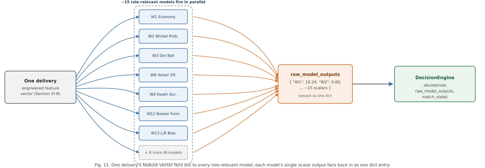

The **decision-engine layer** (`decision_engine/`) is the system's aggregation core
and is organized as five single-responsibility components behind one orchestrating
class:

- **Normalizer** — maps each model's raw output onto a common signal scale of −1
  (strongly against a given action) to +1 (strongly for it), using a
  type-appropriate transformation (Section VII-B).
- **Weighter** — computes, for a given model and match phase, a multiplier equal to
  the product of a phase-relevance factor and the model's reliability score
  (Section VII-C).
- **Aggregator** — for every model that produced a signal, looks up which candidate
  actions that model is configured to support or oppose, multiplies the normalized
  signal by the action direction and the model's weight, and accumulates this
  contribution into a running score per candidate action, retaining a full per-action
  contribution trail for later explanation.
- **RuleValidator** — walks the ranked list of candidate actions from highest score
  downward and, for each, checks a small set of explicit, human-readable rules
  against the live match state (for example, blocking a bowling-change
  recommendation if the current bowler has bowled fewer than two overs); the first
  action that is not blocked becomes the system's chosen recommendation, and every
  ranked action's score and blocked/unblocked status is retained in an audit record.
- **TextGenerator** — converts the validated decision into a natural-language
  tactical plan grouped by target (bowler, field, batter), with phase-appropriate
  instruction templates and a deterministic, context-seeded justification sentence,
  plus an explicit caveat when fewer than 60% of the role's models produced a signal
  for the current context.

A single `DecisionEngine` class wires these five components together behind one
`decide(role, raw_model_outputs, match_state, live_state)` call, so that bowling-side
and batting-side decisions share identical aggregation logic and only differ in which
subset of the 28 models is routed to a given call (approximately 15 models are
relevant to either role at a time).

The **live-inference layer** (`decision_engine/live/`) turns a ball-by-ball scorecard
payload into the model-ready feature vectors described in Section VI-B, loads the
28 persisted models and their encoding manifests, reproduces each model's exact
training-time feature order, and passes the resulting 15 raw scalar outputs (per
role) into the decision engine. Fig. 9 traces this path as a request/response
sequence, from the console's scorecard state through to a rendered recommendation.

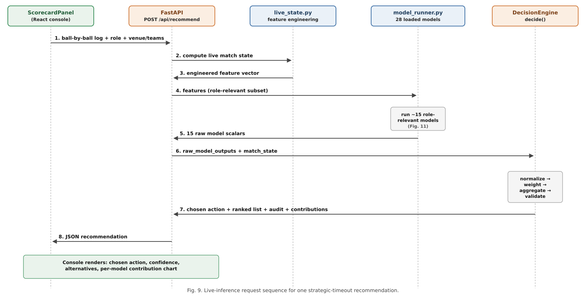

The **service layer** exposes a single FastAPI endpoint, `POST /api/recommend`, which
accepts the role, venue and team context, the full list of deliveries bowled so far
in the current innings, and an optional set of match-state overrides (used to supply
the required and projected run rate needed by one of the rule-validation checks,
since this cannot be inferred from a single innings' ball log alone). The endpoint
returns the chosen action, the full ranked and audited action list, the per-model
contribution breakdown, and the raw scalar every contributing model produced.

The **presentation layer** is a React single-page application providing a
ball-by-ball scorecard editor pre-populated with real professional-league team
rosters, automatic strike-rotation and bowling-change-rule tracking, and a live
detection of the strategic-timeout window that visually prompts the user to request
a recommendation. On request, the recommendation, its ranked alternatives, and a
per-model contribution chart are rendered for the user, with an additional
diagnostics view exposing the raw output of every contributing model for research
and evaluation purposes.

### B. Signal Normalization

Because the 28 models' raw outputs live on incompatible scales — unbounded
regression outputs (an economy rate, a projected score), bounded probabilities in
[0, 1], and already-directional but differently scaled formula outputs — the
Normalizer converts every raw value onto a common [−1, +1] signal before it can be
combined with any other model's output. Probability-type outputs are recentred and
rescaled around the neutral point of 0.5. Formula-type outputs, which are already
signed but have no fixed scale, are compressed with a hyperbolic tangent function
scaled by that model's own historical output standard deviation, so that a formula
with a wide historical spread is not artificially saturated at ±1 by values that are,
for that model, unremarkable. Regression-type outputs are first converted to a
z-score against that model's historical output distribution and then linearly mapped
so that ±2 standard deviations correspond to the signal extremes of ±1, with the
result clipped to the valid range. In every case the final signal is clipped to
[−1, +1] as a safety bound.

### C. Phase- and Reliability-Weighting

A model's influence on the aggregated decision is the product of two independent
multipliers. The first, phase relevance, reflects that a tactic's applicability
depends on where the innings currently stands — for example, a yorker-effectiveness
model is given low weight during the powerplay and high weight in the death overs,
while a powerplay-containment model (trained, by design, only on the snapshot at the
end of the sixth over) is given weight only during the powerplay and zero weight
elsewhere; models without an explicit phase profile default to a neutral,
phase-agnostic weight of 1.0. The second multiplier is the reliability score
described in Section VI-F, loaded directly from the file the reliability-estimation
script produces. The combined weight is therefore context-sensitive (it changes over
the course of an innings) and evidence-sensitive (it changes whenever the underlying
models are retrained and re-evaluated), rather than a static, manually assigned
constant.

### D. Aggregation and Rule Validation

Fig. 6 summarizes the full internal data flow of the decision engine described in
Sections VII-B–VII-E, from a role's raw model outputs through to a rendered
recommendation.

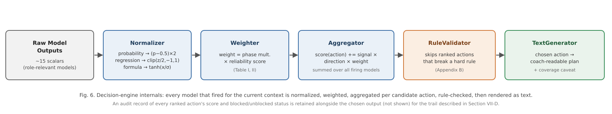

For every model that produced a signal in the current context, and for every
candidate tactical action that model is configured to support or oppose, the
Aggregator computes a signed contribution equal to the model's normalized signal,
multiplied by a fixed per-model, per-action direction coefficient (+1 if the model's
positive signal favours that action, −1 if it argues against it), multiplied by the
model's context-dependent weight, and adds this contribution to a running score for
that action. The direction coefficients are stored in a per-model configuration
table and, where the correct sign was a judgement call rather than a verified fact
(for example, whether a high projected-score signal argues for or against further
batting acceleration), this is documented explicitly in the configuration rather
than silently assumed. Once every model has contributed, the candidate actions are
ranked by score and passed to the RuleValidator, which can demote — but never invent
— a recommendation: any action that violates an explicit, human-readable domain rule
(an insufficient sample of overs bowled or balls faced by the relevant player, a
recent wicket, or, in the death overs, a required-run-rate gap too large for a
defensive action to be sensible) is skipped in favour of the next highest-ranked,
unblocked action, with the full ranked-and-annotated list retained as an audit
trail regardless of which action is ultimately chosen.

### E. Action Space and Natural-Language Generation

The set of candidate actions a recommendation is chosen from is not free-form; it is
drawn from a fixed, pre-authored catalogue of granular tactical directives (for
example, specific field-placement and line-and-length combinations for bowling, or
specific rotation-versus-acceleration directives for batting), each associated in
the model configuration with the set of models that have an opinion on it and the
direction (supporting or opposing) of that opinion. Restricting the action space to
a fixed catalogue, rather than generating actions dynamically, keeps every action
both cricket-legal and interpretable to a coach, and keeps the direction-coefficient
table a finite, auditable object rather than one that would need to grow arbitrarily
with the action space.

Once the RuleValidator has produced a chosen action, the TextGenerator renders it as
a short, coach-readable tactical plan rather than a bare label. Actions are grouped
by their target (the bowler, the field, or the batter), combined with a
phase-appropriate core instruction, and completed with a justification sentence
drawn from a fixed pool associated with that action, selected deterministically from
a small candidate pool seeded by the current over and ball number so that the
phrasing is stable within a single decision but varies across different match
situations. When fewer than 60% of the role's models produced a signal in the
current context — for example, because several matchup-specific models require a
specific batter/bowler pairing that has not yet been established in the innings —
the generated text appends an explicit coverage caveat naming exactly how many of
the role's models contributed, rather than presenting a recommendation built from
partial signal with the same apparent confidence as one built from full signal.

### F. Live Console: Demonstration Scenarios

To demonstrate the framework end to end rather than only describe it, the live
console was exercised against two realistic strategic-timeout scenarios, each built
up ball by ball through the console's scorecard controls rather than the console's
built-in sample-innings shortcut.

**Batting-timeout scenario (powerplay, over 5.5).** A batting-role innings was
scored through the powerplay, with a wicket falling shortly before the timeout,
reaching the batting strategic-timeout window the console flags automatically at
50/2 after 5.5 overs (CRR 8.57). Fig. 12 shows the resulting dashboard: the live
scorecard, the timeout-window indicator, and the decision engine's ranked
recommendation for the batting side at this point in the innings — the top-ranked
action responds directly to the recent wicket.

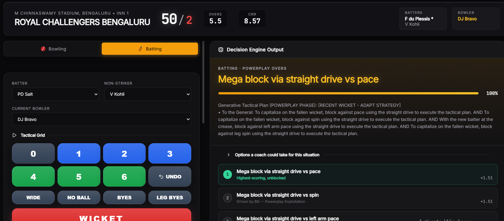

**Bowling-timeout scenario (middle overs, over 13.4).** A separate, independent
bowling-role scenario was built up to 114/1 after 13.4 overs (CRR 8.34) — inside
the middle-overs window — with bowler rotation consistent with the console's
enforced bowling-change rules (no more than four overs per bowler, no consecutive
overs for the same bowler). Fig. 13 shows the resulting dashboard for the bowling
side at this point in the innings.

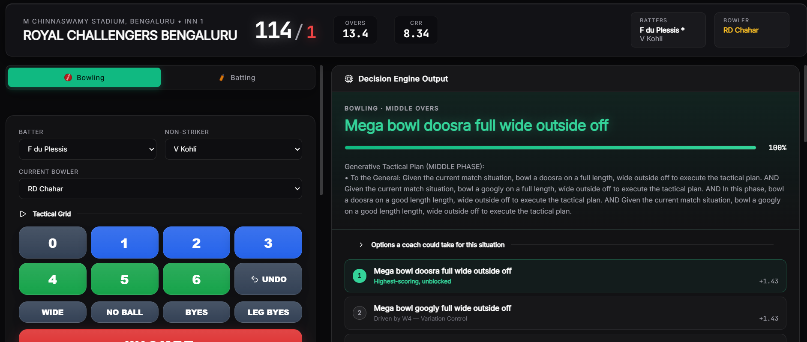

Both scenarios use the console's real, working team-roster data rather than
placeholder names, since the purpose of these figures is to demonstrate the actual
system rather than a mockup of it.

---

## VIII. Dataset Description

The system is trained on a ball-by-ball record of 1,212 professional T20
franchise-league matches, comprising approximately 288,000 individual deliveries.
Each row of the dataset records, at minimum: a match and innings identifier; the
over and ball-within-over number; the batting and bowling team; the venue; the
batter, non-striker, and bowler involved; the runs scored off the bat and the
delivery's total runs (including extras); wide and no-ball indicators; bye and
leg-bye counts; a wicket indicator and, where applicable, the mode of dismissal; and
three mutually exclusive phase indicators marking whether the delivery falls in the
powerplay, the middle overs, or the death overs.

From this raw record, the shared feature-engineering routines described in Section
VI-B derive two families of point-in-time features — the bowling-side running-spell
statistics and the batting-side running-innings statistics — that are recomputed
identically whether the source is the historical training dataset or a live,
in-progress scorecard supplied to the system at inference time. Training examples for
the bowling-side models are restricted to the specific deliveries that end each of
four snapshot overs, aligning every training row with the point in an innings at
which the system's real recommendation would actually be requested.

The dataset has three disclosed structural limitations that bound what several
models can claim to measure: it contains no field recording whether a bowler is
predominantly a pace or spin bowler, no field distinguishing delivery types (for
example, a yorker or a bouncer from a standard-length delivery), and no field
recording a batter's batting-hand. Five models (Section XII-A) are consequently
unable to condition on the specific tactical distinction their names suggest and are
documented, per-model, as measuring a related but coarser quantity instead. This
disclosure is made directly in the model configuration rather than only in this
paper, so that any downstream user of the system's output inherits the same caveat.
The dataset is drawn from a single professional T20 franchise league; Section XII-D
discusses what this does and does not license the system's results to claim about
T20 cricket more broadly.

---

## IX. Experimental Setup

All 28 models were trained on a single machine using the shared pipeline described
in Section VI. For every model, the full set of unique match identifiers was shuffled
with a fixed random seed (42) and split 80% / 20% into training and test matches,
guaranteeing that no delivery from a held-out match's data contributed to that
model's training in any form. Hyperparameters (Section XI) were set per model
according to the target's structure and the rationale in Table 0 (Section VI-E), and
were not subject to an automated tuning search in this iteration of the system; this
is disclosed as a scope limitation in Section XII rather than presented as an
exhaustively tuned result.

Every regression model reports mean absolute error (MAE), root mean squared error
(RMSE), and the coefficient of determination (R²) computed on the held-out test
matches only. Every classification model reports accuracy, precision, recall, F1
score, and — where the predicted probability was available and the test set
contained both classes — the area under the receiver operating characteristic curve
(ROC-AUC), each computed on the held-out test matches only. The one survival-analysis
model (dismissal risk) is evaluated with a calibration-style comparison between the
proportion of deliveries it flags as high risk and the proportion that were actually
followed by a dismissal, since a hazard score is not directly comparable to a binary
classification metric. The one lookup-table component (bowler-form baseline) is
evaluated by the correlation between its train-only-derived lookup value and each
bowler's actual future economy rate in the test set. The two hand-tuned scoring
formulae are reported descriptively (mean, standard deviation, sample size) since
they are not fitted to a target and therefore have no held-out accuracy to report.

### A. The Leakage and Methodology Audit

Before the results in Section XI were produced, the model suite was subjected to a
systematic audit, motivated by the observation that several models were reporting
implausibly strong validation metrics. The audit proceeded model by model and found
four distinct classes of defect, each corrected before the final training run:

**Target leakage.** Four models — an acceleration-capability regressor, a
death-over optimization regressor, a strike-rotation classifier, and a
wicket-loss-mitigation classifier — included, among their input features, quantities
that were direct functions of the very delivery whose outcome they were trying to
predict (specifically, whether that same delivery was a dot ball or a boundary). The
clearest evidence that this leakage was real, rather than a modelling artefact, is
the acceleration model's R² falling from 0.92 before the fix to 0.15 after it — 0.92
is not a credible score for predicting the exact number of runs off one specific,
not-yet-bowled death-over delivery from pre-ball context, while 0.15 is.

**Absent or row-level train/test splitting.** Six models originally used either a
naive, sequential row-level split (in which consecutive rows — often from the same
match — could be divided arbitrarily between train and test) or no split at all
(evaluating a model on the same rows it was fitted on); one additionally fit on a
fixed subset of the first rows in file order and then evaluated on the *entire*
dataset, including the rows it had already trained on. All six were corrected to use
the shared match-level split function described in Section VI-D.

**Test-set contamination in a non-parametric lookup table.** The bowler-form
baseline model builds a per-bowler "career economy" figure used as a naive predictor
of that bowler's future performance. In its original form, this lookup was built from
the *entire* dataset, including matches nominally held out as the test set — meaning
a bowler's test-set outcome was already partially baked into the value being
evaluated against it. The lookup was rebuilt using only training-match data, with a
documented fallback (the global average) for any bowler absent from the training
set, and re-validated via the correlation between the train-only lookup value and
each bowler's actual future economy in the test set (0.134 — a modest but genuine
signal, appropriately weak for a coarse career-average proxy).

**A structurally degenerate forecasting model.** An economy-trend model was
originally implemented as a single, global ARIMA(2,1,2) time-series model fit across
every bowler's economy figures concatenated into one undifferentiated sequence, with
no notion of bowler identity. Multi-step ARIMA forecasts converge toward the series
mean, which is why this model's saved predictions had an essentially zero standard
deviation (approximately 0.00016) — the model was structurally incapable of
producing a bowler-specific forecast, and had no mechanism for producing a live,
per-bowler prediction at all. It was replaced with a supervised regression using the
same snapshot-feature template as every other bowling-side model. The replacement's
predictions have a realistic standard deviation (2.27) but a negative R² (−0.12) —
worse, by this metric, than predicting the mean. This result is reported without
adjustment, and the model's low reliability weight (0.20, the configured floor) is a
direct, disclosed consequence of it.

**Unintentional model duplication.** Two models — nominally a death-over accuracy
model and a powerplay containment model — were found to share an identical target
formula, an identical feature set, and an identical algorithm (LightGBM), and
consequently produced byte-identical output despite being presented as two distinct
tactical models. This was corrected by phase-filtering each model's training data to
the specific snapshot its name implies (over 15 for the death-over model, over 5 for
the powerplay model), after which the two models' metrics diverged meaningfully
(0.642 vs. 0.710 accuracy). A related model (yorker effectiveness) was found to share
the same target formula as well, differing only in its algorithm; its target was
redefined to measure boundary prevention specifically, removing the overlap.

Fig. 10 illustrates the corrected, leakage-safe splitting procedure now used
uniformly across all 28 models.

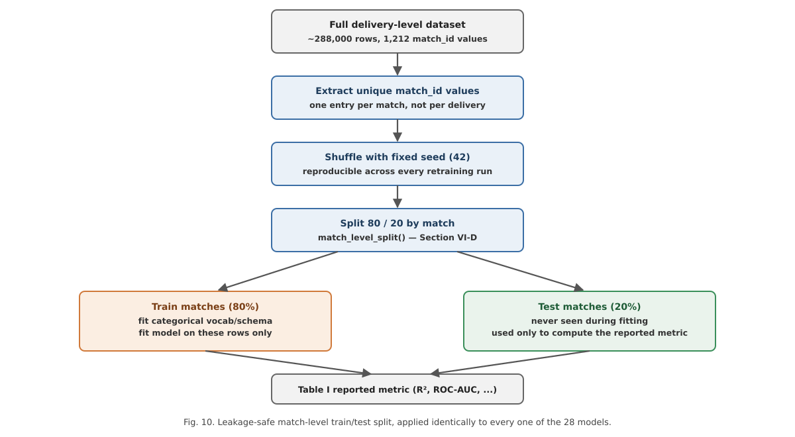

---

## X. Performance Metrics

Model performance is reported using metrics chosen for the structure of each model's
target, consistent with standard practice for the respective task family:

- **Regression models** (predicting a continuous quantity, such as an economy rate,
  a projected score, or a partnership contribution) are evaluated with the
  coefficient of determination (R², the proportion of variance in the held-out
  target explained by the model, with 0 corresponding to no better than predicting
  the mean and negative values indicating worse than the mean), mean absolute error
  (MAE, in the target's native units), and root mean squared error (RMSE, which
  penalizes large errors more heavily than MAE).
- **Classification models** (predicting a binary or multi-class tactical outcome,
  such as whether a wicket falls or whether a delivery is dot-balled) are evaluated
  with accuracy, precision, recall, F1 score, and, where computable, the area under
  the ROC curve — reported alongside the relevant class-imbalance baseline where that
  context materially affects interpretation (for example, a three-class
  shot-aggression model's 45.2% accuracy against a 33.3% random baseline).
- **The survival-analysis model** (dismissal risk) is evaluated with a
  calibration-style comparison between its flagged high-risk rate and the observed
  dismissal rate on the held-out set, since its native output is a relative hazard
  rather than a bounded probability.
- **The lookup-table baseline** (bowler form) is evaluated with a Pearson correlation
  between its train-only-derived estimate and the corresponding held-out outcome.
- **The two hand-tuned formulae** are not evaluated against a held-out target — they
  are not fitted models — and are instead reported descriptively (mean, standard
  deviation, sample size) and assigned a documented, neutral reliability weight in
  the decision engine rather than an invented accuracy figure.

All metrics reported in Section XI are computed exclusively on the 20% of matches
held out by the match-level split described in Section VI-D and IX-A; no reported
metric reflects performance on data used during training.

---

## XI. Results

Table I reports the held-out test performance of the ten most reliable of the 28
models — five bowling-side, five batting-side — together with the algorithm used and
the data-driven reliability weight the decision engine currently assigns to each.
Full per-model figures for all 28 models are computed on the same match-level
held-out test split (Section VI-D) and are summarized visually across the whole
suite in Fig. 2 and Fig. 3 (Section XI-B); metrics below are rounded to three
decimal places.

**Table I. Top 10 models by reliability weight (of 28).**

| ID | Role | Tactical facet | Algorithm | Key metric(s) | Reliability |
|----|------|-----------------|-----------|----------------|:---:|
| W3 | Bowling | Dot Ball Pressure | XGBoost regressor | R² 0.682, MAE 0.056 | 0.879 |
| W1 | Bowling | Economy Predictor | LightGBM regressor | R² 0.648, MAE 1.265 | 0.848 |
| B15 | Batting | Death-Over Optimization | XGBoost regressor | R² 0.587, MAE 8.066 | 0.786 |
| W7 | Bowling | Spin Control * | Random forest classifier | ROC-AUC 0.782, Acc 0.714 | 0.739 |
| W15 | Bowling | Powerplay Containment * | LightGBM classifier | ROC-AUC 0.772, Acc 0.710 | 0.727 |
| B6 | Batting | Partnership Stability | Random forest regressor | R² 0.511, MAE 10.060 | 0.711 |
| W8 | Bowling | Yorker Effectiveness * | CatBoost classifier | ROC-AUC 0.755, Acc 0.700 | 0.706 |
| W5 | Bowling | Bowling Change Optimization | Hand-tuned formula | mean 1.097, σ 3.286 | 0.700 |
| W10 | Bowling | Field-Set Optimization | Hand-tuned formula | mean −2.095, σ 1.946 | 0.700 |
| B5 | Batting | Strike Rotation | Logistic regression | ROC-AUC 0.749, Acc 0.672 | 0.699 |

\* Dataset limitation applies (Section XII-A) — the model measures a coarser
proxy of the tactic its label implies because the underlying delivery-type,
bowler-type, or handedness field is not present in the source data.

At the other end of the ranking, W14 (Economy Trend Analysis, R² = −0.124) is the
suite's weakest model and sits at the configured reliability floor of 0.20; B9
(Spin Vulnerability, ROC-AUC 0.602) illustrates a sharper failure mode discussed in
Section XII-B. As one concrete illustration of what a single model's held-out
evaluation looks like beyond a summary metric, Fig. 8 shows B5's full ROC curve and
threshold-0.5 confusion matrix on the held-out test matches, computed directly from
`B5_results.csv`.

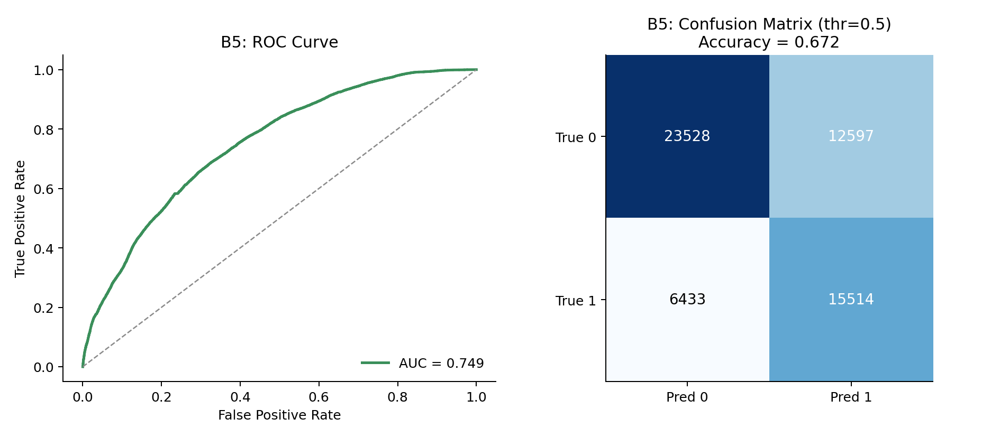

### A. Illustrative End-to-End Trace

To make the abstract description in Section VII concrete, this subsection traces one
representative decision cycle using the system's real, documented constants — the
per-model historical output mean and standard deviation used by the Normalizer, the
phase-relevance multipliers used by the Weighter, and the trained reliability weights
from Table I — with the raw model outputs themselves chosen illustratively, since no
single logged live prediction is being reported here as a claimed result.

Consider a bowling-role decision requested at the death-overs snapshot (the end of
over 15), where the Economy Predictor (W1) returns a raw predicted economy of 11.2
runs per over. W1's historical output distribution has a mean of 8.416 and a
standard deviation of 2.532 (Section VI-B); the Normalizer computes a z-score of
(11.2 − 8.416) / 2.532 ≈ 1.10, and — because W1 is a regression-type model — maps
this onto a signal via `clip(z / 2, −1, 1)`, giving a signal of approximately +0.55.
This is positive because a predicted economy well above this bowler's typical figure
argues in favour of intervention: `change_bowler` carries a direction coefficient of
+1 and `maintain_current_bowler` carries −1. W1 is not listed in the phase-relevance
table and so receives the default multiplier of 1.0 for every phase; combined with
its reliability weight of 0.848 (Table I), its effective weight here is 0.848, and
its contribution to the `change_bowler` score is 0.55 × (+1) × 0.848 ≈ +0.466.

The Yorker Effectiveness model (W8) illustrates the phase-relevance mechanism: for a
raw predicted probability of 0.71, the Normalizer computes (0.71 − 0.5) × 2 = 0.42
directly (probability-type outputs are already scaled). W8 is listed with a
death-overs phase multiplier of 1.3, giving an effective weight of 1.3 × 0.706 ≈
0.918 in the death overs versus just 0.2 × 0.706 ≈ 0.141 in the powerplay — the same
trained model made to matter more or less to the aggregated recommendation purely as
a function of where the ball falls in the innings, without retraining anything.
Fig. 4 plots this example numerically across all three phases, and Fig. 5 shows the
real, held-out predicted-versus-actual fit and feature-importance ranking underlying
the W1 example above, computed directly from `W1_results.csv` and
`W1_feature_importance.csv`; the model's most important feature is, unsurprisingly,
the bowler's current economy in the ongoing spell.

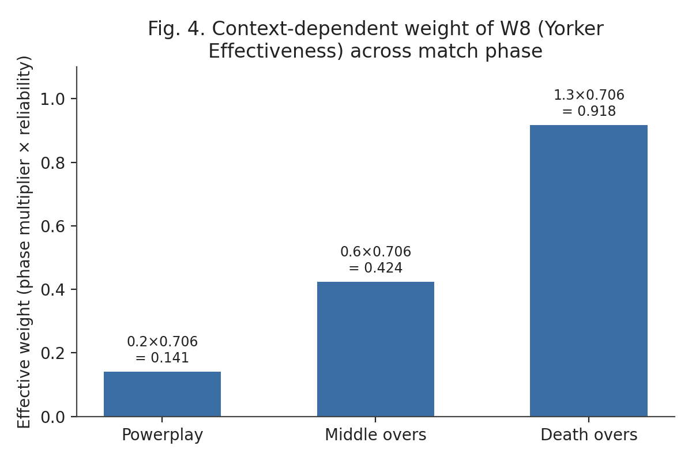
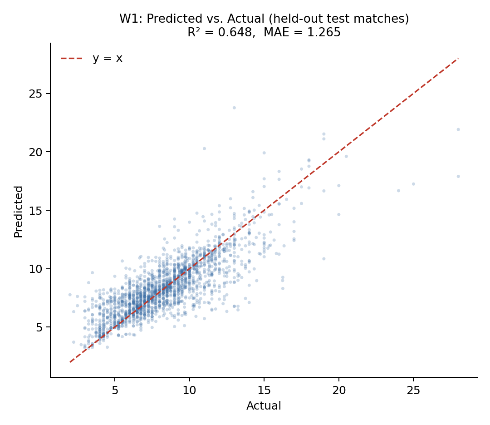
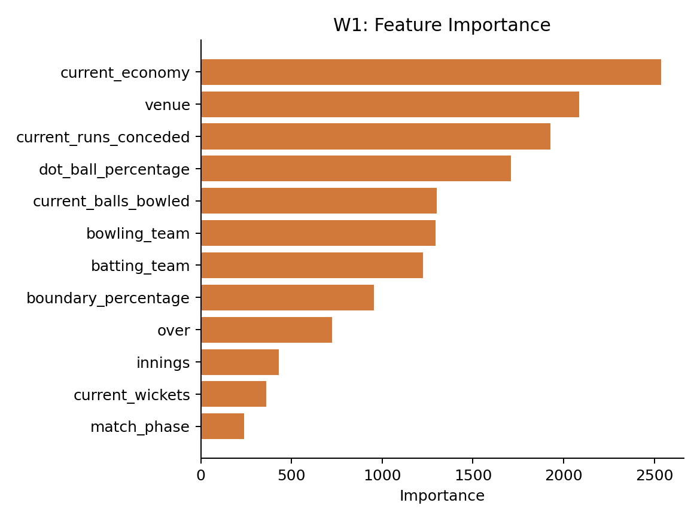

Every model relevant to the requested role that produces a signal in a given context
contributes to the running score of every action it is configured for in exactly
this way; the Aggregator sums these signed, weighted contributions per candidate
action, the RuleValidator removes any action that violates a hard constraint from
contention, and the highest-scoring remaining action becomes the system's
recommendation, with every contributing model's individual contribution retained for
the audit trail shown in the live console.

### B. Cross-Suite Observations

Fig. 2 and Fig. 3 visualize reliability and held-out performance across the full
28-model suite, computed directly from the same `reliability.json` and
`*_training_summary.json` files Table I was transcribed from.

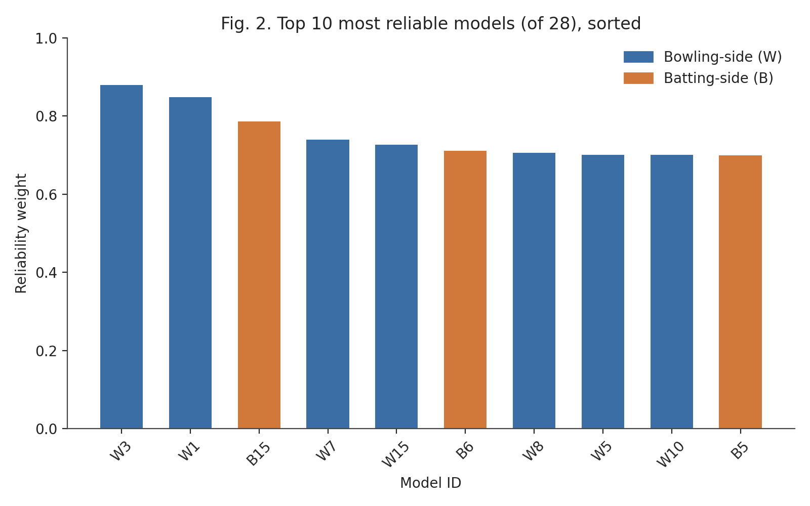

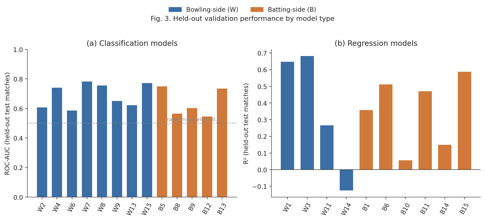

Reliability weights range from a configured floor of 0.20 (W14) to 0.879 (W3),
reflecting the deliberately wide spread between the suite's strongest and weakest
components; the reliability-estimation script is designed to place these values
within a 0.15–1.6 multiplier band, and the observed range in the current trained
suite falls within the lower portion of that band, reflecting that the strongest
models in this suite are solidly, but not exceptionally, predictive.

A simple, unweighted comparison across the two sides of the suite shows the
bowling-side models performing somewhat more strongly, on average, than their
batting-side counterparts on their respective primary metrics: the eight bowling
classifiers average an ROC-AUC of approximately 0.689, against approximately 0.639
for the five batting classifiers with a comparable metric; the four bowling
regressors with an R² metric average approximately 0.368, against approximately
0.355 for the six batting regressors. Both comparisons are close enough, and the
underlying model counts small enough, that this should be read as a mild,
descriptive tendency rather than a statistically established difference; one
plausible contributor is that several of the weakest batting-side models target
fine-grained, high-variance individual-delivery or short-horizon outcomes — the next
six deliveries' scoring rate, one delivery's exact acceleration in runs, a single
delivery's dismissal risk against a phase-general feature set — which are
intrinsically harder to predict from pre-ball context than the spell-level and
over-level aggregates most bowling-side models target.

---

## XII. Discussion

### A. What the Dataset Cannot Support

Three fields absent from the source dataset — bowler type (pace or spin), delivery
type (for example, yorker, bouncer, or slower ball), and batter handedness —
constrain what five of the 28 models can measure. A model labelled "Spin Control"
cannot condition on whether the bowler is actually a spin bowler; it necessarily
measures dot-ball control in general. A model labelled "Yorker Effectiveness" cannot
verify that a yorker was actually bowled; it measures general future
boundary-prevention. A model labelled "L/R Matchup Bias" cannot see a batter's
handedness and so measures general spell-improvement and wicket-taking bias rather
than a literal handedness matchup effect. This limitation is disclosed per-model in
the system's own configuration, not only in this paper, precisely because it bounds
the claims a user of the system's output should be willing to make; no amount of
additional model tuning corrects for information that was never recorded in the
source data.

### B. Honest Reporting of Weak Models

Seven of the 28 models perform only marginally better — or, in one case, worse —
than a naive baseline. This is reported directly rather than omitted: the
reliability-weighting mechanism (Section VII-C) is designed to consume exactly this
information, automatically down-weighting a weak model relative to stronger ones so
its presence does not proportionally distort the aggregated recommendation the way
an unweighted ensemble member would; and presenting only favourable metrics would
misrepresent both the current state of the system and the genuine difficulty of
several of the underlying prediction problems. Fig. 7 makes this concrete by
plotting W14 — the suite's weakest model (R² = −0.124) — on the same
predicted-versus-actual axes as the strong W1 example in Fig. 5: where Fig. 5's
points cluster tightly along the diagonal, Fig. 7's are visibly scattered around a
near-flat band, the visual signature of a model whose predictions carry little
relationship to the outcome being predicted.

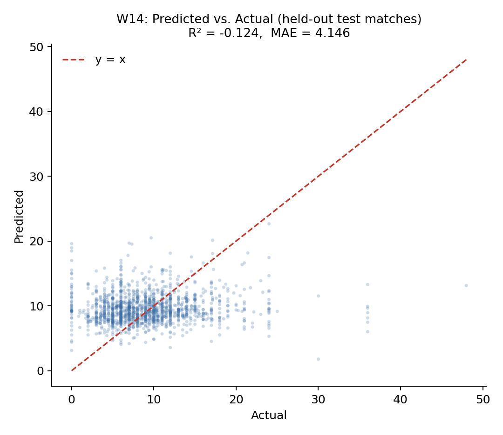

A sharper case than W14's low R² is B9 (Spin Vulnerability), whose ROC-AUC of 0.602
reads as merely mediocre on its own but conceals a more specific failure: at the
standard 0.5 decision threshold, B9's precision is 0.076 against a recall of 0.437.
That is, of every delivery B9 flags as a dismissal-risk event, roughly 92.4% are
false positives — under the severe class imbalance of a rare, phase-general wicket
target, the model has learned to fire often rather than fire correctly, and a
moderate ROC-AUC is compatible with this because ROC-AUC integrates performance
across all thresholds, including ones a live system would never actually use. This
is why the reliability-weighting mechanism is derived from the disclosed metric
directly rather than from a qualitative "acceptable/unacceptable" label a reader
might otherwise be tempted to assign from ROC-AUC alone.

### C. Design Trade-offs in the Aggregation Mechanism

The decision engine's normalization, weighting, and aggregation logic (Section
VII-B–D) was designed around explainability at least as much as around predictive
optimality — the specific reason the system's original two-tier design (Section
VI-A) was not realized as specified. A trained Tier 2 — the design documentation's
"Master Batting Coach" and "Master Bowling Coach," a stacked ensemble in the sense of
Wolpert [14] fit on Tier 1's own predictions — might outperform the current
hand-specified normalization and phase-relevance scheme on some aggregate metric,
but the substitution actually made was chosen specifically to avoid what that
meta-learner would cost: the current audit trail (Section VII-D) can attribute the
*n*-th ranked action's score to specific, named contributing models with disclosed
weights; a trained Tier 2 would instead attribute it to whatever the meta-learner's
own internal weights happened to converge to during fitting, not guaranteed to
correspond to anything a coach could interrogate model-by-model. This was judged
more valuable for a decision-support tool intended to sit alongside human tactical
judgement than a further increment of aggregate accuracy would be, and Section XV
identifies a learned aggregation layer as a candidate direction for future work
precisely because it was not adopted here.

### D. Scope Limitations

The evaluation in this paper is confined to offline, held-out validation on
historical match data from a single professional T20 franchise league; the system
has not yet been evaluated through a live user study with coaching staff, nor
validated against ground-truth tactical outcomes (whether a recommended action, had
it been followed, would have produced a better result than the alternative). Model
hyperparameters were set by domain-informed choice rather than an automated search,
which Section XV identifies as a direction for improving several of the
weaker-performing models. The dataset is drawn from a single T20 competition;
generalization to other T20 leagues, playing conditions, or the international game
has not been tested, and the reported metrics should be read as characterizing the
system's performance within that one competition rather than across T20 cricket as
a whole.

### E. Interpretability as a Design Goal

Several of the design choices described in Sections VI and VII are best understood
as explainability mechanisms rather than purely predictive ones. The reliability
weight attached to every model (Table I) is not only a performance-scaling device
but a disclosure device: it makes visible, at the point of decision, exactly how
much the system is choosing to trust each contributing signal, rather than
presenting 28 model outputs as equally authoritative. The audit trail produced by
the RuleValidator retains the score and blocked/unblocked status of every ranked
action, not only the winner, so that a coach questioning why a particular option was
not chosen — including options that scored higher than the recommended one but were
tactically disqualified — can be shown the specific rule responsible rather than
told to trust the system's output. The coverage caveat appended by the
TextGenerator when fewer than 60% of a role's models fired is a direct,
human-readable statement of the recommendation's evidentiary basis in that specific
context, rather than a fixed, context-independent confidence claim. This is a
deliberately different, and complementary, notion of explainability from
feature-attribution techniques such as SHAP [18] or LIME [19] (Section II-F): those
methods explain *why one model* produced a given output in terms of its input
features, whereas the mechanisms above explain *why the system as a whole* produced
a given recommendation in terms of which models contributed, how much, and how
reliable each was known to be.

### F. Ethical and Deployment Considerations

Because TOP is explicitly framed as a decision-*support* tool rather than a
decision-*making* one, its design deliberately preserves a human in the loop at
every stage: the RuleValidator can only demote a statistically favoured action, not
promote one the model outputs did not support, and every generated recommendation is
presented alongside its full ranked alternatives and audit trail specifically so
that a coach retains the information needed to disagree with it. Two risks
nonetheless warrant explicit acknowledgement. The first is automation bias: a
coaching staff under the same time pressure the system is designed to relieve may be
inclined to accept a ranked, confidently-presented recommendation without engaging
with the coverage caveat or audit trail that qualifies it, particularly for the
seven models identified in Section XI as weak; the coverage-caveat mechanism is a
partial mitigation, but a live user study (Section XV) is the only way to establish
whether it is sufficient in practice. The second is that the underlying dataset is
built from identifiable, named professional cricketers' publicly recorded on-field
performance; no personally sensitive information beyond public match records is
used, and the system's outputs are tactical (an action to take) rather than
evaluative (a judgement about a specific named player's ability or worth), which
meaningfully narrows its potential for individual-level misuse relative to, for
example, a player-valuation or scouting system — but any future extension toward
player-specific profiling rather than situational tactical recommendation would
warrant a fresh review of this framing.

---

## XIII. Comparison with Existing Methods

Table III positions TOP qualitatively against the closest categories of prior work
identified in Section II, along the dimensions most relevant to its design goals:
temporal scope, decision granularity, combination transparency, and leakage
disclosure.

**Table III. Qualitative comparison with the closest prior approaches.**

| Approach category | Representative work | Temporal scope | Decision output | Weighting transparency | Leakage audit disclosed |
|---|---|---|---|---|---|
| Pre-match / outcome prediction | T20 franchise-league win-prediction studies [2], [3] | Pre-match or coarse in-match snapshot | Single scalar (win probability / outcome class) | N/A (typically single-model) | Rarely reported |
| In-play win probability | Dynamic in-play ODI model [4] | Continuous, in-match | Single scalar (win probability) | N/A (single model) | Not applicable |
| Single-situation tactical AI | TacticAI (football corner kicks) [7] | In-match, single set-piece type | Ranked tactical suggestions for one situation type | Internal to one learned model | Not reported |
| Substitution-timing ML | Football substitution prediction [12] | In-match, one decision type | Binary/ranked substitution recommendation | N/A (single or small model set) | Not reported |
| Generic multi-sport CI/DSS surveys | Computational-intelligence DSS reviews [6] | Varies by surveyed system | Varies by surveyed system | Rarely standardized across surveyed systems | Rarely reported |
| **TOP (this work)** | — | In-match, every strategic time-out across an innings | Ranked multi-action recommendation with full audit trail | Reliability weight traceable to each model's own disclosed validation metric | Full model-by-model audit reported (Section IX-A) |

Three points follow from this comparison. First, TOP's temporal scope — a
recommendation refreshed at every strategic time-out across an entire innings,
rather than a single pre-match estimate or a one-off situational suggestion — is
closer to the in-play win-probability tradition [4] than to the pre-match prediction
literature that otherwise dominates cricket analytics [2]–[3], but TOP departs from
that in-play tradition by outputting a ranked set of concrete tactical actions
rather than a single probability. Second, among systems that do output a concrete
tactical suggestion, TacticAI [7] is the closest architectural precedent in
ambition, but it addresses a single, narrowly bounded tactical situation (a corner
kick) with one learned model, whereas TOP addresses a continuously evolving
innings-wide decision using 28 independently trained, narrowly scoped models
combined through an explicit, disclosed weighting mechanism; the two systems are
best read as complementary points in the design space (single-situation deep
learning versus many-model, reliability-weighted aggregation) rather than as
directly competing solutions to the same problem. Third, none of the compared
approaches report a systematic, model-by-model leakage and split-methodology audit
alongside their headline metrics in the way Section IX-A of this paper does; this is
offered as a methodological contribution independent of any single model's raw
predictive performance — a template other applied, multi-model sports-analytics
systems could adopt regardless of the specific sport or tactical decision they
target.

A direct, head-to-head quantitative comparison against TacticAI or the in-play
win-probability literature was not attempted in this work, for a reason more
specific than "no benchmark exists." TacticAI's reported evaluation is a
forced-choice preference judgement by professional coaches, a protocol measuring
plausibility rather than any ground-truth label TOP's ranked actions could be scored
against; the in-play win-probability model of [4] outputs a single continuous
probability calibrated against completed-match outcomes, a different prediction
target than a discrete tactical action; and no publicly available dataset pairs T20
strategic-timeout moments with an agreed-upon correct tactical response at all, so
even a same-metric comparison would have no shared test set to run on. This is
itself a direct consequence of the research gap identified in Section III, and is
noted here rather than papered over with a metric-for-metric comparison that would
be technically computable but not actually meaningful.

---

## XIV. Conclusion

This paper presented TOP, a real-time decision-support system that aggregates 28
independently trained, narrowly scoped machine learning models into a single,
ranked, and auditable tactical recommendation for T20 cricket coaching staff during
strategic time-outs. The system's central contribution is methodological as much as
architectural: every model is trained and evaluated with a consistent, leakage-safe,
match-level splitting methodology; a systematic audit identified and corrected
target leakage in four models, absent or row-level splitting in six others, test-set
contamination in a lookup-table component, a structurally degenerate forecasting
model, and two unintentionally duplicated models, with before/after metrics reported
for each; and the resulting model suite — including its several genuinely weak
components — is combined through a reliability-weighting mechanism derived directly
from each model's own disclosed validation performance, rather than a flat or
hand-tuned trust assumption. A working FastAPI backend and React-based live console
demonstrate the framework end to end on a real ball-by-ball scorecard workflow,
exercised in this paper against realistic batting- and bowling-timeout scenarios
(Section VII-F). The system is offered as a decision-support tool intended to
surface and rank tactical options transparently, not to replace the judgement of a
coach or captain, and its honestly reported limitations — dataset fields it does not
have access to, models whose predictive power is currently weak, a single-league
training dataset, and evaluation that remains offline rather than validated through
live use — are intended to scope what a user of this system's output should, and
should not, conclude from it.

---

## XV. Future Work

Several directions follow directly from the limitations identified in Section XII.
Extending the source dataset with delivery-type, bowler-type, and batter-handedness
fields would allow the five affected models (Section XII-A) to measure the specific
tactical distinctions their labels currently only approximate. A systematic
hyperparameter search, rather than the domain-informed fixed configurations used in
this iteration, is a direct avenue for improving the several models identified as
weak in Section XI. The most direct such avenue is completing the system's original
two-tier design (Section VI-A): training the specified Tier 2 "Master Batting Coach"
and "Master Bowling Coach" — a calibrated meta-learner per role, fit on Tier 1's own
predictions against realized match outcomes, in the spirit of Wolpert's stacked
generalization [14]. Realizing this tier would need to be evaluated on three axes at
once: aggregate accuracy against the current rule-based aggregator; the
interpretability cost discussed in Section XII-C, since a second trained model
reintroduces exactly the opacity the current design was chosen to avoid; and the
live-inference latency budget the design documentation targets for this tier
(sub-second per recommendation), which the current deterministic aggregator
satisfies trivially but a second model pass is not guaranteed to. Applying
feature-attribution techniques such as SHAP [18] or LIME [19] to the individual W-
and B-models, as flagged in Section XII-E, would add a second, complementary layer
of explainability beneath the decision engine's existing model-level audit trail.
Beyond offline validation, a live evaluation with coaching staff — comparing
recommendations accepted, overridden, or ignored against subsequent match outcomes —
would test the system's practical value in a way the current held-out metrics
cannot, and would also produce the first dataset suitable for a genuinely
cricket-specific study of strategic-timeout effectiveness, closing the literature
gap identified in Section II-C. Finally, extending the training dataset beyond a
single professional T20 franchise league to other T20 leagues and to international
T20 cricket would test, and likely improve, the generalization of the underlying
models beyond the conditions of one competition.

---

## References

[1] I. Wickramasinghe, "Applications of machine learning in cricket: A systematic review," *Machine Learning with Applications*, vol. 10, p. 100435, 2022.

[2] S. Priya et al., "Analysis and winning prediction in T20 cricket using machine learning," in *Proc. IEEE Conf.*, 2022.

[3] S. Chakraborty, A. Mondal, A. Bhattacharjee, A. Mallick, R. Santra, S. Maity, and L. Dey, "Cricket data analytics: Forecasting T20 match winners through machine learning," *Int. J. Knowledge-Based Intell. Eng. Syst.*, vol. 28, no. 1, 2024.

[4] M. Asif and I. G. McHale, "In-play forecasting of win probability in One-Day International cricket: A dynamic logistic regression model," *Int. J. Forecasting*, vol. 32, no. 1, pp. 34–43, 2016.

[5] R. A. Lokhande, R. N. Awale, and R. R. Ingle, "Forecasting bowler performance in One-Day International cricket using machine learning," *Expert Syst. Appl.*, 2025.

[6] R. P. Bonidia et al., "Computational intelligence in sports: A systematic literature review," *arXiv:1810.12850*, 2018.

[7] Z. Wang, P. Veličković, D. Hennes, N. Tomašev, et al., "TacticAI: an AI assistant for football tactics," *Nature Communications*, vol. 15, p. 1906, 2024.

[8] S. Kranzinger, C. Halmich, and D. Hofer, "A scoping review of explainable artificial intelligence in sports science," *Discover Artificial Intelligence*, 2025.

[9] M. Qiu, K. Zhang, Y. Chao, and M. Zhang, "Interrupt or reinforce? The impact of timeout on momentum in basketball game," *Frontiers in Psychology*, vol. 16, p. 1673186, 2025.

[10] J. Prieto et al., "Effects of team timeouts on the teams' scoring performance in elite handball close games," *Kinesiology*, vol. 48, no. 1, pp. 115–123, 2016.

[11] C. Fernández-Echeverría, J. González-Silva, I. T. Castro, and M. P. Moreno, "The timeout in sports: A study of its effect on volleyball," *Frontiers in Psychology*, 2019.

[12] A. Mohandas, M. Ahsan, and J. Haider, "Tactically maximize game advantage by predicting football substitutions using machine learning," *Big Data and Cognitive Computing*, vol. 7, no. 2, p. 117, 2023.

[13] T. G. Dietterich, "Ensemble methods in machine learning," in *Multiple Classifier Systems (MCS 2000)*, LNCS vol. 1857, Springer, 2000, pp. 1–15.

[14] D. H. Wolpert, "Stacked generalization," *Neural Networks*, vol. 5, no. 2, pp. 241–259, 1992.

[15] R. M. O. Cruz, R. Sabourin, and G. D. C. Cavalcanti, "Dynamic classifier selection: Recent advances and perspectives," *Information Fusion*, vol. 41, pp. 195–216, 2018.

[16] S. Kaufman, S. Rosset, and C. Perlich, "Leakage in data mining: Formulation, detection, and avoidance," *ACM Trans. Knowledge Discovery from Data*, vol. 6, no. 4, 2012.

[17] S. Kapoor and A. Narayanan, "Leakage and the reproducibility crisis in machine-learning-based science," *Patterns*, vol. 4, no. 9, p. 100804, 2023.

[18] S. M. Lundberg and S. Lee, "A unified approach to interpreting model predictions," in *Proc. NeurIPS*, 2017.

[19] M. T. Ribeiro, S. Singh, and C. Guestrin, "'Why should I trust you?': Explaining the predictions of any classifier," in *Proc. ACM SIGKDD (KDD)*, 2016.

[20] J. H. Friedman, "Greedy function approximation: A gradient boosting machine," *Annals of Statistics*, vol. 29, no. 5, pp. 1189–1232, 2001.

[21] T. Chen and C. Guestrin, "XGBoost: A scalable tree boosting system," in *Proc. ACM SIGKDD (KDD)*, 2016.

[22] G. Ke, Q. Meng, T. Finley, T. Wang, W. Chen, W. Ma, Q. Ye, and T.-Y. Liu, "LightGBM: A highly efficient gradient boosting decision tree," in *Proc. NeurIPS*, 2017.

[23] L. Prokhorenkova, G. Gusev, A. Vorobev, A. V. Dorogush, and A. Gulin, "CatBoost: Unbiased boosting with categorical features," in *Proc. NeurIPS*, 2018.

[24] D. R. Cox, "Regression models and life-tables," *J. Royal Statistical Society: Series B*, vol. 34, no. 2, pp. 187–220, 1972.

[25] I. Gómez-Méndez et al., "Benchmarking classical, machine learning, and Bayesian survival models for clinical prediction," *arXiv:2509.10073*, 2025.
