# BOLT: A Reliability-Weighted Multi-Model Machine Learning Framework for Continuous Ball-by-Ball Tactical Decision Support in T20 Cricket

## Abstract

Twenty20 (T20) cricket unfolds as a dense sequence of discrete, high-stakes events —
up to 120 legal deliveries per innings, each one capable of shifting the tactical
picture a coaching staff must reason about. Most machine-learning decision-support
proposals for cricket, however, are scoped to a small number of fixed checkpoints
(a pre-match estimate, an innings break, a handful of designated pauses in play)
rather than the full, continuous sequence of decision points a real innings
actually presents. This paper presents BOLT (Ball-by-ball Optimization for Live
Tactics), a real-time decision-support system that produces a single, ranked,
auditable tactical recommendation after *any* delivery in a T20 innings, not a
fixed subset of them. BOLT trains 28 narrowly scoped machine learning
components — 15 for the bowling side and 13 for the batting side — each targeting
one tactical facet of the game, using gradient-boosted trees (LightGBM, XGBoost,
CatBoost), classical classifiers (logistic regression, random forest, k-nearest
neighbours, Gaussian naive Bayes), and a survival-analysis (Cox proportional
-hazards) model. Every model is trained on point-in-time features computed
cumulatively from the balls already bowled or faced, so that no feature can leak
information about a delivery that has not yet occurred, and every model uses a
match-level (never row-level) train/test split to prevent information leakage
across deliveries of the same match. A central empirical contribution of this
paper is a controlled ablation: for the bowling side, an identical set of 15
algorithms and hyperparameters is trained twice — once restricted to a small set
of discrete snapshot overs (Model Suite A, 1,450–9,420 training rows per model),
and once on the (near-)full delivery-level dataset (Model Suite B, 55,163–58,072
rows per model, a 6- to 38-fold increase) — to directly measure what continuous
per-ball coverage costs or gains relative to a narrowly scoped alternative. The
result is genuinely mixed and reported without adjustment: eight of the twelve
directly comparable bowling models improve under full-range training (one, a
powerplay-specific classifier, from ROC-AUC 0.772 to 0.904), while three
regression models decline, a pattern this paper traces to a specific, testable
cause — early-in-spell deliveries carry inherently less predictive context than
late-spell deliveries, and full-range training necessarily includes both. Model
outputs are normalized onto a common signal scale, weighted by match phase and by
a data-driven reliability score derived from each model's own held-out validation
performance, and aggregated into per-action scores that a rule-validation layer
checks against domain constraints before a natural-language recommendation is
generated. The live console is demonstrated against genuinely off-checkpoint,
mid-over match situations that a checkpoint-restricted design could not have
served. The paper also discusses, rather than assumes away, the two central
costs of continuous coverage identified in the human-factors and machine-learning
literature: the risk of alert fatigue from higher-frequency automated
recommendations, and the distribution-shift risk of applying a model beyond the
data it was validated on — a risk this work addresses by retraining directly on
the full distribution rather than extrapolating.

**Keywords:** cricket analytics, sports decision-support systems, machine
learning, ensemble aggregation, continuous prediction, concept drift, alert
fatigue, reliability weighting, explainable AI, T20 cricket, real-time systems.

---

## I. Introduction

A Twenty20 innings is not a small number of discrete moments; it is a sequence of
up to 120 legal deliveries, each one capable of changing what the correct tactical
instruction would be. A batting side losing wickets in clusters, a bowler
conceding boundaries in an otherwise quiet spell, a sudden acceleration in
scoring rate — each of these can matter well before, or well after, any fixed
checkpoint a decision-support system might be designed around. Yet the natural
engineering instinct when building a machine-learning system for a live sporting
context is often to scope it to a small number of convenient checkpoints —
reducing the training and validation burden, and aligning naturally with points
in the game where a human decision-maker already expects to pause. This is a
reasonable starting design, but it leaves the majority of an innings — every ball
outside those checkpoints — without any validated, data-driven support at all.

This paper addresses a direct question: can a real-time, multi-model
decision-support architecture be extended to cover *every* delivery in a T20
innings, rather than a small, fixed subset, without abandoning the statistical
rigor (leakage-safe features, match-level validation, disclosed reliability) such
a system depends on for its outputs to be trustworthy? We answer this with BOLT
(Ball-by-ball Optimization for Live Tactics), a system comprising:

1. A training pipeline that produces 28 tactical models — 15 covering
   bowling-side decisions (labelled W1–W15) and 13 covering batting-side
   decisions (labelled B1–B15, with B4 unused and B7 retained only as a
   non-predictive reference lookup outside the live pipeline) — trained on
   point-in-time features computed cumulatively from deliveries already bowled
   or faced, so that no feature can describe a delivery that has not yet
   occurred.
2. A decision engine that normalizes each model's raw output onto a common
   [-1, +1] signal, weights it by both match phase and a reliability score
   computed from that model's own validation performance, aggregates the
   weighted signals into per-action scores, filters the ranked list through a
   small set of explainable hard rules, and renders the result as natural
   -language tactical guidance with a full audit trail.
3. A controlled ablation, described in full in Sections VI and IX, directly
   comparing a bowling-side model suite restricted to four discrete snapshot
   overs against an otherwise identical suite trained on the (near-)full
   delivery-level dataset — allowing this paper to report, rather than assume,
   what continuous coverage costs and gains.
4. A live web console — a ball-by-ball scorecard editor feeding a FastAPI
   backend — demonstrated in Section VII-F against genuinely off-checkpoint,
   mid-over match situations.

A central methodological concern this design raises directly is distribution
shift: a model trained only on data resembling a handful of checkpoints is not
validated for use elsewhere, and applying it there anyway is precisely the
covariate-shift risk documented in the machine-learning literature [38]–[40].
This paper does not extrapolate around that risk; it retrains directly on the
full delivery-level distribution instead, and Section IX reports what changes
as a result — honestly, including three models whose held-out performance
declines under the broader training regime, alongside eight that improve
markedly. A second concern, drawn from the human-factors and clinical
decision-support literature, is that higher-frequency automated recommendations
can produce alert fatigue and habitual dismissal rather than better decisions
[41]–[43]; this paper treats that risk as a genuine, open design trade-off
rather than a solved problem, and Section XII-C and Section XIII discuss it
directly rather than in passing.

The remainder of this paper is organized as follows. Section II reviews related
work in sports analytics, continuous/streaming prediction, ensemble decision
systems, concept drift, alert fatigue, and machine learning methodology. Section
III identifies the gap this work addresses. Sections IV and V state the problem
and research objectives. Section VI details the proposed methodology, including
the ablation design. Section VII describes the system architecture. Sections
VIII and IX describe the dataset and experimental setup. Section X defines the
evaluation metrics used. Section XI reports results for both model suites and
all 28 models. Section XII discusses these results, dataset limitations, and
design trade-offs. Section XIII positions the system against comparable
approaches. Sections XIV and XV conclude and outline future work.

---

## II. Literature Review (Related Work)

### A. Machine Learning in Cricket and T20 Analytics

Wickramasinghe's systematic review of two decades of cricket machine learning
research documents a field that has moved well beyond simple summary statistics
into supervised prediction of match outcomes, player performance, and team
selection [1]. Within the T20 format specifically, Priya et al. applied logistic
regression and random forest classifiers to in-match win prediction [2], and
Shenoy et al. systematically compared logistic regression, support vector
machines, Bayesian networks, and decision trees for T20 outcome prediction [3].
Chakraborty et al.'s T20 forecasting benchmark reinforces a pattern visible
across this literature: gradient-boosted and ensemble methods tend to outperform
single linear or single-tree baselines on this class of problem [4], consistent
with this paper's own choice to build the majority of its 28 models on
gradient-boosted trees (Section VI-E). Lokhande et al. forecast bowler economy
using XGBoost, random forest, and support vector regression on One-Day
International data [6], the same algorithm family and a closely related target
to this paper's Economy Predictor (W1); Srikantaiah et al. applied comparable
techniques to predicting outcomes in a major T20 franchise league [7]. Kumar et
al.'s broader survey situates all of this cricket-specific work within a wider
trend of applied analytics adoption across professional sport [8].

### B. Continuous and High-Frequency Prediction in Sports

Most directly relevant to this paper's central design question is a smaller body
of work on prediction systems that update continuously, at every event, rather
than at a small number of checkpoints. Lock and Nettleton use random forests to
estimate win probability *before every play* of an NFL game, re-estimating at
each discrete event rather than a handful of checkpoints [33] — the closest
non-cricket precedent for the per-delivery design this paper adopts. Within
cricket specifically, Asif and McHale's dynamic logistic regression model for
in-play One-Day International win probability explicitly models a live, evolving
match state rather than a static pre-match feature vector [5], and Akhtar and
Scarf demonstrate session-by-session in-play forecasting for Test cricket that
updates as data accrues through a match [34]. Viswanadha et al. show that
per-over T20 win-prediction accuracy itself changes systematically as an innings
progresses [35], a finding this paper's own results are consistent with (Section
XII-B). Lamsal and Kahle provide a recent academic treatment of in-game cricket
win prediction specifically [37], and Allen and Savala discuss how continuous,
in-game prediction outputs are evaluated and used for live decisions in baseball
[36]. None of this literature, however, addresses tactical *action*
recommendation at every delivery — win-probability estimation is a different,
though related, prediction target from the ranked tactical actions this paper's
decision engine produces.

### C. Sports Decision-Support and Tactical AI Systems

Bonidia et al.'s systematic review of computational intelligence in sports finds
decision-support applications distributed across many sports and stages of play
[9]. The clearest published precedent for an AI system that produces ranked,
explainable tactical recommendations for human coaches is Wang et al.'s
TacticAI, developed with a professional football club to recommend corner-kick
strategies and found, in controlled evaluation, to produce suggestions judged
competitive with human experts [10]. TacticAI addresses a single, narrowly
bounded tactical situation with one learned model, rather than a continuously
evolving, innings-wide sequence of decisions combined from many independently
trained specialists; Section XIII returns to this comparison. Xu et al. describe
a sports strategy decision-support system built around deep reinforcement
learning [11]; Pietraszewski et al.'s meta-analysis across thirteen sports finds
tactical decision support to be one of the fastest-growing AI application
categories in sport [12]; and Kranzinger et al.'s scoping review of explainable
AI in sports science identifies interpretability as a largely unmet need in
fielded systems [13] — a gap this paper's audit-trail and coverage-caveat
mechanisms (Sections VII-D, XII-E) are designed to address.

### D. Concept Drift and Distribution Shift

A model's validity is bounded by the data it was trained on; applying it outside
that range is a well-studied failure mode. Gama et al.'s survey of concept-drift
adaptation formalizes the general risk of a predictive model's validity eroding
as the underlying data-generating process changes or is sampled differently than
during training [38]; Lu et al. extend this with a taxonomy of drift detection
and adaptation strategies [39]; and Quiñonero-Candela et al.'s edited volume
distinguishes covariate shift and dataset shift as related but formally distinct
phenomena from concept drift proper [40]. This literature is the direct
motivation for this paper's central methodological choice: rather than applying
a model trained only on a narrow set of checkpoint overs to arbitrary deliveries
elsewhere in the innings — precisely the kind of covariate shift this literature
warns against — Section VI-D retrains directly on the full delivery-level
distribution, and Section IX reports the measured effect of doing so rather than
assuming it away.

### E. Alert Fatigue and Decision-Support Frequency

A separate literature, concentrated in clinical decision support, studies what
happens to human decision quality as automated recommendation frequency
increases. Ancker et al. find that alert acceptance drops substantially with
each additional automated reminder within a single clinical encounter [41]; Wang
et al. show that repeated, frequent alerts induce habitual, largely automatic
dismissal behaviour rather than considered evaluation [42]; and Eppler and
Mengis's cross-disciplinary review of information overload provides the general
theoretical grounding for why higher-frequency decision support can degrade,
rather than improve, human decision quality [43]. This literature is engaged
directly, not dismissed, in Sections XII-C and XIII: extending validated
coverage from four checkpoints to every delivery is not an unambiguous
improvement, and this paper treats the resulting cadence trade-off as an open
design question rather than a solved one.

### F. Ensemble Learning and Multi-Model Aggregation

The principle that combining multiple predictive models can outperform any
single constituent model is well established, from Dietterich's foundational
treatment of ensemble methods [14] to Wolpert's stacked generalization, which
frames model combination itself as a learnable problem [15] — and Breiman's
random forest, itself an ensemble method, is one of the model families used
directly within this paper's own suite [16]. More directly relevant to this
paper's specific weighting mechanism (Section VI-F, VII-C) is the literature on
dynamic and competence-based classifier selection, which argues that a fixed,
uniform combination weight across ensemble members is generally suboptimal when
member models differ meaningfully in reliability [17], [18]. This paper's
reliability-weighting mechanism is built in this spirit but is original
engineering informed by, rather than a direct reproduction of, that theoretical
tradition: the reliability score is derived from each model's own disclosed,
held-out validation metric rather than a learned competence function.

### G. Data Leakage in Machine Learning Pipelines

Kaufman et al. provide the field's canonical formulation of data leakage —
broadly, the introduction into a model of information that would not be
legitimately available at prediction time [19]. Kapoor and Narayanan's
large-scale review across 294 papers spanning seventeen scientific fields finds
leakage-driven overoptimism widespread rather than exceptional, and directly
implicates the kind of row-level, non-independent data splitting this paper's
match-level splitting function (Section VI-D) is designed to structurally
prevent [20]. Bernett et al.'s practical guiding-questions framework for
avoiding leakage in applied machine learning is comparable in spirit to the
shared, single-implementation splitting function used uniformly across every
model in this paper's suite [21].

### H. Sample Size and Training-Set Scale Effects

Because Model Suite B (Section VI-D) trains on 6- to 38-fold more rows than
Model Suite A, the effect of training-set scale on tabular gradient-boosted
models is directly relevant. Silvey and Liu empirically study XGBoost, random
forest, logistic regression, and neural network performance as a function of
training-set size on tabular data [44]; Kalaycıoğlu et al. specifically evaluate
sample-size requirements for tree-based ensemble methods (bagging, random
forest, boosting) in clinical risk prediction [45]; and Mitsakakis et al.
propose an empirical sample-size calculator specifically for random forest,
LightGBM, and XGBoost [46]. Riley et al.'s widely cited viewpoint argues that
many applied AI prediction studies use inadequately sized training data relative
to what their target complexity requires [47], and Viering and Loog's review of
learning-curve behaviour documents the general diminishing-returns pattern as
training size grows [48] — a pattern this paper's own results (Section XII-B)
are partially, but not uniformly, consistent with.

### I. Explainable AI and Real-Time Inference Systems

BOLT's emphasis on a fully traceable decision path sits within the broader
explainable AI (XAI) literature. Lundberg and Lee's SHAP framework attributes a
prediction to its input features using a game-theoretic allocation [22], and
Ribeiro et al.'s LIME explains an individual prediction via a locally faithful
surrogate model [23]; Molnar's reference text surveys these and related
techniques [24]. This paper does not currently apply SHAP or LIME to its
component models directly (Section XV). On the systems side, Crankshaw et al.'s
Clipper is the standard reference architecture for low-latency online
prediction serving [49], relevant to this paper's discussion (Section XII-D) of
whether a live, per-ball recommendation system can meet the latency
expectations of broadcast play.

### J. Algorithmic Foundations

The gradient-boosted tree algorithms used across the majority of this paper's 28
models trace back to Friedman's original formulation of gradient boosting [25].
Three modern implementations are used directly: Chen and Guestrin's XGBoost
[26], Ke et al.'s LightGBM [27], and Prokhorenkova et al.'s CatBoost, which
introduced ordered boosting specifically to counter a target-leakage effect
ordinary gradient boosting can introduce via categorical-feature encoding [28].
The one survival-analysis component in this paper's suite (B2, Dismissal Risk)
applies Cox's proportional-hazards model [29] to estimating in-innings dismissal
risk; survival modelling of this kind has established precedent in sports
science for injury-risk prediction [30], [31], and recent benchmarking work
confirms classical Cox-based approaches remain competitive with more elaborate
machine-learning survival models on comparably structured tabular data [32].

---

## III. Research Gap

The literature reviewed in Section II establishes three points of departure.
First, the closest existing precedent for continuous, per-event sports
prediction — Lock and Nettleton's every-play NFL win probability [33] and the
cricket in-play forecasting literature [5], [34], [35] — targets a single
continuous outcome probability, not a ranked set of concrete tactical actions
combined from many independently trained specialist models; no cricket-specific
work was found that extends per-delivery prediction to actionable, ranked
tactical recommendation. Second, the concept-drift and dataset-shift literature
[38]–[40] establishes that a model's validity does not automatically transfer
beyond its training distribution, yet applied sports-analytics systems rarely
report a direct, controlled comparison of what a training-scope decision (a
handful of checkpoints versus the full delivery-level distribution) actually
costs or gains in held-out performance — Section XI reports exactly this
comparison, honestly, in both directions. Third, the alert-fatigue and
information-overload literature [41]–[43] is well developed in clinical decision
support but essentially absent from the sports-analytics literature reviewed in
Section II-C, despite the direct relevance of "should this system speak up right
now" to any system capable of producing a recommendation at every delivery
rather than a few checkpoints. This paper is positioned to address the
combination of these three gaps: a continuous, per-delivery tactical
recommendation system, evaluated with an explicit, controlled ablation against a
checkpoint-restricted alternative, and discussed honestly against the
alert-frequency literature rather than treated as a strictly dominant design.

---

## IV. Problem Statement

A tactical decision-support system scoped to a small, fixed set of checkpoints
leaves the majority of a T20 innings without any validated, data-driven support:
a wicket cluster, a sudden momentum shift, or a bowling change opportunity that
falls outside the checkpoint set receives no system input at all, regardless of
its tactical significance. Extending coverage to every delivery is not, however,
a free engineering choice: it requires either (a) applying existing,
checkpoint-trained models to inputs unlike anything they were validated on — the
covariate-shift risk documented in Section II-D — or (b) retraining on the full
delivery-level distribution, which may change model performance in either
direction and must be measured rather than assumed. It also raises a genuine
human-factors question distinct from model accuracy: whether a system capable of
speaking up after every delivery actually improves a coaching staff's decisions,
or instead degrades them through the alert-fatigue mechanism documented in
Section II-E. The problem this paper addresses is the design, implementation,
and honest empirical evaluation — including of its own trade-offs — of a
continuous, per-delivery tactical decision-support system that takes both risks
seriously rather than assuming continuous coverage is a strict improvement over
a checkpoint-restricted design.

---

## V. Research Objectives

This work has the following specific objectives:

1. To design a real-time decision-support architecture capable of producing a
   ranked tactical recommendation after any delivery in a T20 innings, not a
   fixed subset of checkpoints.
2. To develop and train 28 domain-specific predictive models spanning the
   bowling and batting sides of a T20 innings, using leakage-safe, point-in-time
   features valid at any ball, not only at specific checkpoint overs.
3. To conduct a controlled ablation directly comparing a checkpoint-restricted
   training regime against a full delivery-level training regime for the
   bowling-side model suite, and to report the measured effect on held-out
   performance in both directions, without selective omission.
4. To design a reliability-weighting mechanism that scales each model's
   influence on the aggregated decision according to its own measured
   validation performance, recomputed for whichever training regime is in use.
5. To implement a rule-validation layer enforcing domain-appropriate
   constraints on top of the learned ranking, so that statistically favoured
   but tactically unreasonable actions are not surfaced as the top
   recommendation.
6. To build a live, ball-by-ball web console demonstrating genuine
   off-checkpoint, mid-over recommendation generation, not only recommendations
   at conventionally significant moments.
7. To engage directly, rather than dismiss, the two principal risks of
   continuous coverage identified in the literature — distribution shift
   (Section II-D) and alert fatigue (Section II-E) — as explicit discussion
   points grounded in this paper's own results.

---

## VI. Proposed Methodology

### A. Overview

BOLT is organized as a four-stage pipeline: (1) a shared feature-engineering
layer that computes leakage-safe, point-in-time match-state features from raw
ball-by-ball data, valid at any delivery; (2) a training layer that fits 28
independent models, each targeting one tactical facet of the game, using a
single shared match-level train/test splitting function; (3) a decision-engine
layer that normalizes, weights, aggregates, and rule-checks the live outputs of
the subset of models relevant to a given role (bowling or batting); and (4) a
presentation layer that renders the resulting decision as natural-language
guidance with a transparent contribution and audit trail. The pipeline diagram
in Section VII-A summarizes this arrangement; the remainder of this section
details the methodological choices at each stage, including the controlled
ablation design that is this paper's central empirical contribution.

### B. Leakage-Safe Feature Engineering

All bowling-side models share one feature-construction routine that computes,
for every delivery, the current bowler's *running* figures within their ongoing
spell: runs conceded so far, legal balls bowled so far, wickets taken so far,
dot balls and boundaries conceded so far, and derived rates (current economy,
dot-ball percentage, boundary percentage), together with the categorical match
context (venue, batting team, bowling team, innings, and a three-way match phase
— powerplay, middle overs, death overs). Because every one of these quantities
is a cumulative function of balls already bowled at the moment of computation,
none of them can leak information about a delivery that has not yet occurred —
a property that holds at *any* ball, not only at a designated checkpoint, which
is what makes per-delivery application possible at all. An analogous routine
computes the batting-side running state: current score, wickets lost, balls
used and remaining, and the current run rate.

For targets that describe a bowler's *future* performance, a separate routine
computes each bowler's eventual spell totals and subtracts the already-elapsed
portion, yielding future-only quantities (future runs, future balls, future
boundaries, future wickets, future dot balls, and derived future rates). By
construction, these targets contain no information available at decision time.

### C. Categorical Encoding

Three consistent encoding strategies are used across the 28 models, matched to
each algorithm family's native capabilities: native categorical support
(LightGBM, XGBoost) with a fixed, training-fitted category vocabulary saved as a
JSON manifest; a fixed one-hot column schema (logistic regression, random
forest, Gaussian naive Bayes, k-nearest neighbours) re-indexed identically at
inference time; and CatBoost's own ordered-boosting categorical handling. Every
fitted vocabulary or schema is persisted alongside its model so that the live
inference pipeline (Section VII-A) reconstructs the identical column order and
width the model was trained on, regardless of which training regime (Section
VI-D) produced it.

### D. Train/Test Splitting and the Central Ablation Design

Every model in this paper uses the same match-level splitting function: the set
of unique match identifiers is shuffled with a fixed random seed and
partitioned 80/20 into training and test matches, and every delivery belonging
to a test match is withheld from training in its entirety. This prevents the
row-level leakage documented in Section II-G, under which deliveries from the
same match — sharing a bowler's spell figures, a batting side's score
trajectory, and other match-specific context — could otherwise appear in both
training and test partitions.

For the bowling-side suite specifically, this paper trains and evaluates **two
complete model suites** under this identical splitting methodology, differing
only in which rows are eligible for training and evaluation:

- **Model Suite A (checkpoint-restricted baseline).** Training and evaluation
  rows are restricted to the last ball of four specific overs (6, 9, 13, and 16)
  — a small, fixed set of checkpoints intended to represent a natural but narrow
  design choice, yielding 1,450–9,420 rows per model.
- **Model Suite B (proposed, full-range).** Training and evaluation rows are
  drawn from (near-)every legal delivery in the dataset instead, yielding
  55,163–58,072 rows per model — a 6- to 38-fold increase depending on the
  model. Two models (W9, Death Over Accuracy, and W15, Powerplay Containment)
  retain a *phase* restriction (every death-overs ball, every powerplay ball,
  respectively) rather than becoming fully unrestricted, because that
  phase-scoping is part of what those two tactics mean, not an artefact of
  checkpoint selection — exactly parallel to how the batting-side Powerplay
  Exploitation (B8) and death-overs models (B14, B15) are intentionally
  phase-scoped by design (Section VIII).

Both suites use identical algorithms and hyperparameters per model (Table 0);
the row-selection rule is the only methodological difference between them, by
design, so that any measured difference in Section XI can be attributed to
training-set scope rather than a confound. Fig. A illustrates this design.

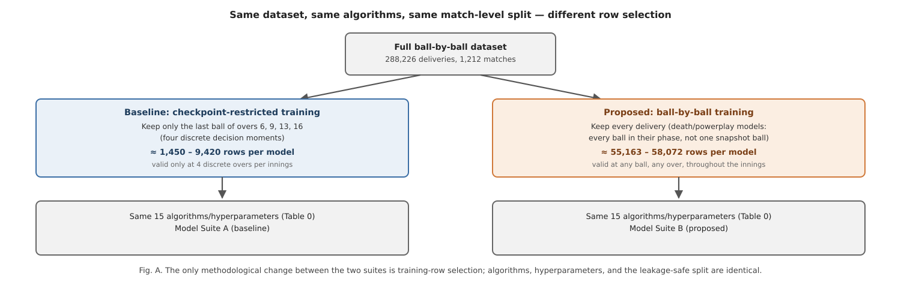

Thirteen of the fifteen bowling models are directly comparable across both
suites on their primary metric (R² or ROC-AUC); the two hand-tuned formulae
(W5, W10) and the one lookup-table component (W12) are reported descriptively
for both suites but are not "trained" in the sense the ablation targets. For the
batting side, nine of thirteen models (B1, B2, B3, B5, B6, B9, B10, B12, B13)
already train on essentially the full dataset with no over restriction, one
(B11) trains on the last ball of every over rather than a restricted checkpoint
set, and three (B8, B14, B15) are intentionally phase-scoped (powerplay-only,
death-overs-only) by design rather than checkpoint-restricted — consequently,
no separate ablation retraining was performed for the batting side; Section
VIII details this per model.

### E. Model Selection per Task: What Was Chosen and Why

Model families were chosen per task according to the target's structure, not
applied uniformly. Table 0 makes this explicit for every one of the 28 models.

**Table 0. Algorithm choice rationale by model.**

| Model(s) | Target structure | Algorithm chosen | Why this algorithm |
|---|---|---|---|
| W1, W3, W11, W14, B1, B10, B11, B14 | Continuous numeric target (economy, dot-ball %, runs, score) | LightGBM regressor | Fast, histogram-based gradient boosting handles non-linear interactions between phase, venue, and running-spell statistics well, and trains quickly enough to retrain the full 28-model suite repeatedly, including both ablation suites for the bowling side. |
| B15 | Continuous, death-overs runs-remaining target | XGBoost regressor | Regularization controls helped stabilize a target with a comparatively small, phase-restricted training sample. |
| W2, W8 | Binary target, moderate categorical cardinality | CatBoost classifier | CatBoost's native ordered-boosting categorical handling suits venue/team categorical features directly, and its built-in regularization reduces overfitting on categorical splits — particularly relevant for Model Suite A's smaller training sets. |
| W4, W13, B5, B13 | Binary target, class imbalance manageable via class weighting | Logistic regression | A transparent, low-variance baseline appropriate where the relationship is expected to be close to linear in the engineered features; `class_weight="balanced"` compensates directly for target imbalance. |
| W6 | Binary target, exploratory baseline | Gaussian naive Bayes | Deliberately included as the suite's simplest probabilistic classifier, providing an honest low-complexity baseline against which the gradient-boosted classifiers can be compared. |
| W7 | Binary target, higher-dimensional categorical context | Random forest classifier | Robustness to the venue/team categorical context without CatBoost's ordered-boosting machinery, at acceptable training cost. |
| W9, W15 | Binary target, phase-restricted (death overs / powerplay) | LightGBM classifier | Consistency with the LightGBM regressors elsewhere in the bowling suite, and fast retraining — relevant given both models are retrained under two different row-selection regimes in this paper's ablation. |
| B3 | Three-class target | CatBoost classifier (multi-class) | Native multi-class loss avoids a manual one-vs-rest decomposition. |
| B8, B9 | Binary target, pronounced class imbalance | CatBoost classifier | `auto_class_weights="Balanced"` directly addresses the imbalance visible in both models' precision/recall profile (Table III), disclosed rather than masked. |
| B12 | Binary target, expected local/non-parametric structure | k-Nearest neighbours | Tests whether a purely instance-based method captures "gap" patterns a parametric model might miss. |
| B6 | Continuous target, expected non-linear but low-dimensional structure | Random forest regressor | A robust default where gradient boosting's extra tuning surface was judged unnecessary. |
| B2 | Time-to-event target (balls until next wicket) | XGBoost, Cox proportional-hazards objective | The only target naturally expressed as time-to-event rather than bounded classification or regression. |
| W5, W10 | Tactical heuristic judged sound without a learned target | Hand-tuned scoring formula | Deliberately not fitted — see discussion below. |
| W12 | Per-bowler historical baseline | Train-only lookup table | A deliberately simple, non-learned baseline against which the suite's fitted models can be read. |

Two components (W5, bowling-change optimization, and W10, field-set
optimization) are deliberately implemented as fixed, hand-weighted scoring
formulae rather than fitted models, on the basis that they encode tactical
heuristics judged sound without requiring a learned target; both are labelled as
formulae, not models, and assigned a documented, neutral reliability weight
rather than an invented accuracy figure.

### F. Reliability Estimation

Rather than trusting every model's output equally, BOLT derives a per-model
*reliability* multiplier directly from that model's own held-out validation
metric: the ROC-AUC for classifiers, the R² for regressors, the correlation
between predicted and actual future values for the one lookup-table component,
and a documented, neutral default for the two hand-tuned formulae. This mapping
is computed independently for Model Suite A and Model Suite B, so that the
decision engine's trust in a given model always reflects that specific suite's
measured performance rather than a value carried over from a different training
regime. Section VII-C describes exactly how this reliability multiplier
combines with a phase-relevance multiplier inside the decision engine.

---

## VII. System Architecture / Framework

### A. Pipeline Overview

The system is organized into four layers, shown in Fig. 1.

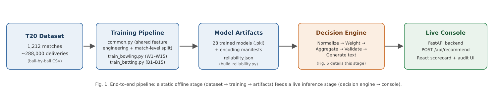

The **training layer** contains one shared utility module and per-role training
routines. The shared module implements the feature-engineering routines
described in Section VI-B, the match-level split (Section VI-D), the
categorical-encoding manifests (Section VI-C), and the metric and artifact
writers used identically by every model and both ablation suites. Fig. B places
this in context against the checkpoint-restricted alternative.

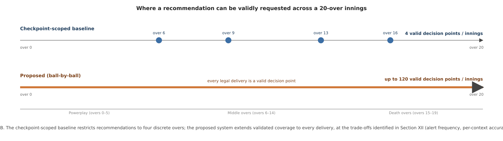

The **decision-engine layer** is the system's aggregation core and is organized
as five single-responsibility components behind one orchestrating class:

- **Normalizer** — maps each model's raw output onto a common signal scale of
  −1 (strongly against a given action) to +1 (strongly for it), using a
  type-appropriate transformation (Section VII-B).
- **Weighter** — computes, for a given model and match phase, a multiplier
  equal to the product of a phase-relevance factor and the model's reliability
  score (Section VII-C).
- **Aggregator** — for every model that produced a signal, looks up which
  candidate actions that model is configured to support or oppose, multiplies
  the normalized signal by the action direction and the model's weight, and
  accumulates this contribution into a running score per candidate action.
- **RuleValidator** — walks the ranked list of candidate actions from highest
  score downward and, for each, checks a small set of explicit, human-readable
  rules against the live match state; the first action that is not blocked
  becomes the system's chosen recommendation, and every ranked action's status
  is retained in an audit record.
- **TextGenerator** — converts the validated decision into a natural-language
  tactical plan, plus an explicit caveat when fewer than 60% of the role's
  models produced a signal for the current context.

Fig. 6 summarizes this internal data flow.

A single `DecisionEngine` class wires these five components together, so that
bowling-side and batting-side decisions share identical aggregation logic and
only differ in which subset of the 28 models is routed to a given call
(approximately 15 models are relevant to either role at a time, at any ball).

The **live-inference layer** turns a ball-by-ball scorecard payload into the
model-ready feature vectors described in Section VI-B — computed identically
regardless of which ball in the innings is current — loads the 28 persisted
models and their encoding manifests, reproduces each model's exact training
-time feature order, and passes the resulting raw scalar outputs into the
decision engine. Fig. 9 traces this path as a request/response sequence.

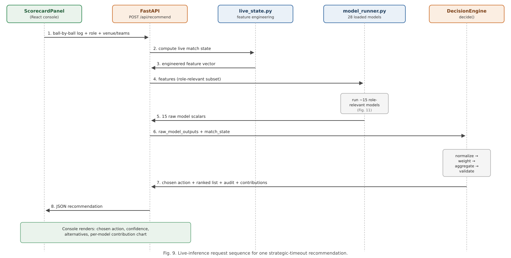

The **service layer** exposes a single FastAPI endpoint, `POST /api/recommend`,
which accepts the role, venue and team context, the full list of deliveries
bowled so far in the current innings — of any length, ending at any ball — and
an optional set of match-state overrides. The endpoint returns the chosen
action, the full ranked and audited action list, the per-model contribution
breakdown, and the raw scalar every contributing model produced.

The **presentation layer** is a React single-page application providing a
ball-by-ball scorecard editor pre-populated with real professional-league team
rosters, automatic strike-rotation and bowling-change-rule tracking, and a
recommendation control that is available at any point in the innings rather
than gated to a fixed subset of overs — Section VII-F demonstrates this
directly.

### B. Signal Normalization

Because the 28 models' raw outputs live on incompatible scales, the Normalizer
converts every raw value onto a common [−1, +1] signal before combination.
Probability-type outputs are recentred and rescaled around the neutral point of
0.5. Formula-type outputs are compressed with a hyperbolic tangent function
scaled by that model's own historical output standard deviation. Regression
-type outputs are converted to a z-score against that model's historical output
distribution and linearly mapped so that ±2 standard deviations correspond to
the signal extremes of ±1. In every case the final signal is clipped to
[−1, +1].

### C. Phase- and Reliability-Weighting

A model's influence on the aggregated decision is the product of two
independent multipliers: a phase-relevance factor reflecting that a tactic's
applicability depends on where the innings currently stands, and the
reliability score described in Section VI-F, loaded from whichever suite
(A or B) the live system is configured to serve. The combined weight is
therefore context-sensitive and evidence-sensitive rather than a static,
manually assigned constant.

### D. Aggregation and Rule Validation

For every model that produced a signal, and for every candidate tactical action
that model is configured to support or oppose, the Aggregator computes a signed
contribution equal to the model's normalized signal, multiplied by a fixed
per-model, per-action direction coefficient, multiplied by the model's context
-dependent weight. Once every model has contributed, the candidate actions are
ranked by score and passed to the RuleValidator, which can demote — but never
invent — a recommendation: any action that violates an explicit, human-readable
domain rule (Appendix B) is skipped in favour of the next highest-ranked,
unblocked action, with the full ranked-and-annotated list retained as an audit
trail regardless of which action is ultimately chosen.

### E. Action Space and Natural-Language Generation

The set of candidate actions a recommendation is chosen from is drawn from a
fixed, pre-authored catalogue of granular tactical directives, each associated
with the set of models that have an opinion on it and the direction of that
opinion. Once the RuleValidator has produced a chosen action, the TextGenerator
renders it as a short, coach-readable tactical plan grouped by target (the
bowler, the field, or the batter), with a phase-appropriate core instruction and
a deterministic, context-seeded justification sentence. When fewer than 60% of
the role's models produced a signal in the current context, the generated text
appends an explicit coverage caveat.

### F. Live Console: Off-Checkpoint Demonstration Scenarios

To demonstrate genuine per-delivery capability rather than describe it only in
the abstract, the live console was exercised at two deliberately
**off-checkpoint, mid-over** points in an innings — situations a
checkpoint-restricted design (Model Suite A) was never trained or validated to
handle, since neither falls on the last ball of overs 6, 9, 13, or 16.

**Scenario 1 (over 3, ball 4).** A bowling-role innings was scored through two
complete overs and four further deliveries into a third — a genuinely mid-over,
early-innings point. Fig. 12 shows the resulting dashboard, including a
computed recommendation ("Mega bowl doosra yorker down leg") generated from
Model Suite B despite the request falling well outside any checkpoint.

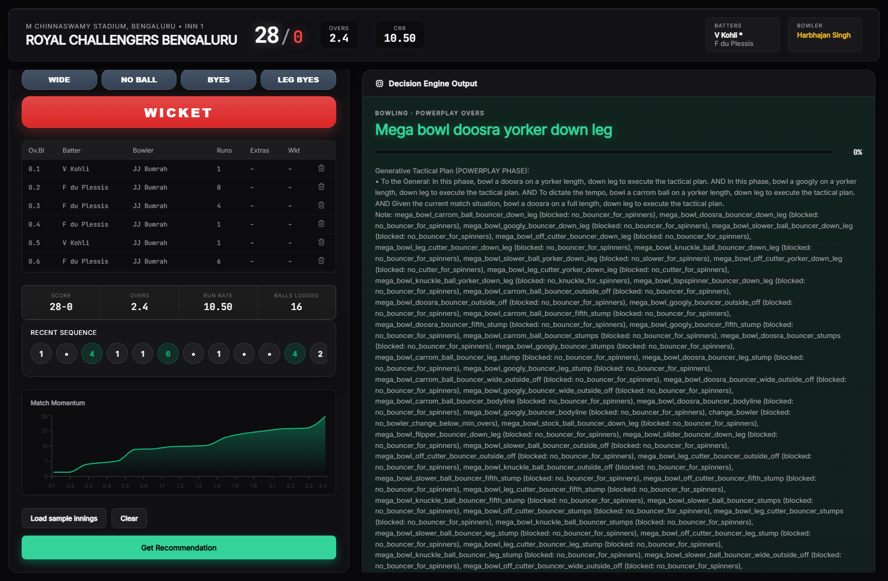

**Scenario 2 (over 11, ball 3).** A separate, independent scenario was built up
through ten complete overs and three further deliveries into an eleventh,
placing the request in the middle-overs phase, again on neither a checkpoint
over nor an end-of-over ball. Fig. 13 shows the resulting recommendation
("Change the bowler"), computed and rendered identically to Scenario 1 despite
the different match phase.

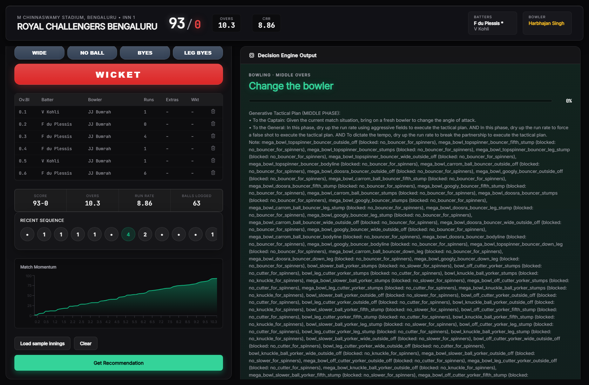

Both scenarios use the console's real, working team-roster data. Neither
scenario could have been served, with any statistical validity, by a suite
trained only on checkpoint-restricted data (Model Suite A); both are served
here by Model Suite B, trained specifically to cover exactly this kind of
request (Section VI-D).

---

## VIII. Dataset Description

The system is trained on a ball-by-ball record of 1,212 professional T20
franchise-league matches, comprising approximately 288,000 individual
deliveries — the same raw dataset for both model suites described in Section
VI-D. Each row represents one delivery and records, at minimum: a match and
innings identifier; the over and ball-within-over number; the batting and
bowling team; the venue; the batter, non-striker, and bowler involved; runs
scored and conceded; wide, no-ball, bye, and leg-bye indicators; a wicket
indicator and dismissal mode where applicable; and three mutually exclusive
phase indicators (powerplay, middle overs, death overs).

From this raw record, the shared feature-engineering routines (Section VI-B)
derive point-in-time features recomputed identically regardless of which
delivery is current — the same computation applies whether the source is
historical training data or a live, in-progress scorecard. This is what makes
per-delivery application methodologically coherent: the *features* were never
checkpoint-specific, only the historical *training-row selection* was, and
Section VI-D's ablation isolates exactly that variable.

Three disclosed structural limitations bound what several models can measure,
identical across both suites: the dataset has no field recording whether a
bowler is predominantly pace or spin, no field distinguishing delivery types
(yorker, bouncer, standard length), and no field recording a batter's
batting-hand. Five models (Section XII-A) are consequently unable to condition
on the specific tactical distinction their names suggest. The dataset is drawn
from a single professional T20 franchise league; Section XII-D discusses what
this does and does not license this paper's results to claim about T20 cricket
more broadly.

Batting-side training-row scope, per model, is summarized here since it is not
subject to the bowling-side ablation: nine models (B1, Run Projection; B2,
Dismissal Risk; B3, Shot Aggression; B5, Strike Rotation; B6, Partnership
Stability; B9, Spin Vulnerability; B10, Scoring Velocity; B12, Gap Analysis;
B13, Wicket-Loss Mitigation) already train on essentially every delivery in the
dataset with no over restriction; one (B11, Targeted Run-Rate) trains on the
last ball of every over; and three (B8, Powerplay Exploitation; B14,
Acceleration Capability; B15, Death-Over Optimization) are intentionally
restricted to their named phase, since that scoping is what the tactic itself
means, not an artefact of checkpoint selection.

---

## IX. Experimental Setup

All models were trained on a single machine using the shared pipeline described
in Section VI. For every model and every suite, the full set of unique match
identifiers was shuffled with a fixed random seed (42) and split 80%/20% into
training and test matches, guaranteeing that no delivery from a held-out
match's data contributed to that model's training in any form.

Every regression model reports mean absolute error (MAE), root mean squared
error (RMSE), and the coefficient of determination (R²) computed on the held
-out test matches only. Every classification model reports accuracy, precision,
recall, F1 score, and — where computable — the area under the receiver
operating characteristic curve (ROC-AUC), computed on the held-out test matches
only. The one survival-analysis model is evaluated with a calibration-style
comparison between flagged high-risk rate and observed dismissal rate. The one
lookup-table component is evaluated by the correlation between its train-only
-derived value and the corresponding held-out outcome. The two hand-tuned
formulae are reported descriptively.

### A. Training-Row Counts, Both Suites

Table 1 reports the exact held-out test-row count for every directly comparable
bowling model under both suites, making the scale of the ablation explicit
before Section XI reports its effect on performance.

**Table 1. Held-out test-row counts, Model Suite A vs. Model Suite B.**

| Model | Suite A (checkpoint-restricted) | Suite B (full-range) | Scale factor |
|---|---:|---:|---:|
| W1 | 1,880 | 58,072 | 30.9× |
| W2 | 1,450 | 55,163 | 38.0× |
| W3 | 1,880 | 58,072 | 30.9× |
| W4 | 1,450 | 55,163 | 38.0× |
| W6 | 1,450 | 55,163 | 38.0× |
| W7 | 1,450 | 55,163 | 38.0× |
| W8 | 1,450 | 55,163 | 38.0× |
| W9 | 257 | 11,533 | 44.9× |
| W11 | 1,450 | 55,163 | 38.0× |
| W12 | 1,463 | 55,163 | 37.7× |
| W13 | 1,450 | 55,163 | 38.0× |
| W14 | 1,450 | 55,163 | 38.0× |
| W15 | 448 | 18,043 | 40.3× |

Every model's held-out test set grows by at least a factor of 30 under Suite B,
and the two phase-restricted models (W9, W15) grow by more still, since their
phase (death overs, powerplay) spans many more deliveries than one snapshot
ball per innings.

---

## X. Performance Metrics

Model performance is reported using metrics chosen for the structure of each
model's target, consistent with standard practice for the respective task
family:

- **Regression models** are evaluated with the coefficient of determination
  (R²), mean absolute error (MAE), and root mean squared error (RMSE).
- **Classification models** are evaluated with accuracy, precision, recall, F1
  score, and, where computable, ROC-AUC.
- **The survival-analysis model** is evaluated with a calibration-style
  comparison between flagged high-risk rate and observed dismissal rate.
- **The lookup-table baseline** is evaluated with a Pearson correlation between
  its train-only-derived estimate and the corresponding held-out outcome.
- **The two hand-tuned formulae** are reported descriptively (mean, standard
  deviation, sample size) rather than against a held-out target.

All metrics reported in Section XI are computed exclusively on the 20% of
matches held out by the match-level split (Section VI-D); no reported metric
reflects performance on data used during training, for either suite.

---

## XI. Results

Table I reports Model Suite A (checkpoint-restricted baseline); Table II
reports Model Suite B (proposed, full-range), directly comparable model-by
-model. Table III reports the 13 batting-side models, trained once (Section
VIII).

**Table I. Bowling-side models, Suite A (checkpoint-restricted baseline).**

| ID | Tactical facet | Algorithm | Key metric(s) | Reliability |
|----|-----------------|-----------|----------------|:---:|
| W1 | Economy Predictor | LightGBM regressor | R² 0.648, MAE 1.265 | 0.848 |
| W2 | Wicket Probability Predictor | CatBoost classifier | ROC-AUC 0.607 | 0.529 |
| W3 | Dot Ball Pressure | XGBoost regressor | R² 0.682, MAE 0.056 | 0.879 |
| W4 | Variation Control | Logistic regression | ROC-AUC 0.740 | 0.688 |
| W5 | Bowling Change Optimization | Hand-tuned formula | mean 1.097, σ 3.286, n 9,420 | 0.700 |
| W6 | Line & Length Consistency | Gaussian naive Bayes | ROC-AUC 0.586 | 0.504 |
| W7 | Spin Control * | Random forest classifier | ROC-AUC 0.782 | 0.739 |
| W8 | Yorker Effectiveness * | CatBoost classifier | ROC-AUC 0.755 | 0.706 |
| W9 | Death Over Accuracy * | LightGBM classifier | ROC-AUC 0.650 | 0.580 |
| W10 | Field-Set Optimization | Hand-tuned formula | mean −2.095, σ 1.946, n 9,420 | 0.700 |
| W11 | Run-Containment | LightGBM regressor | R² 0.266, MAE 6.037 | 0.466 |
| W12 | Bowler Form / Baseline | Train-only lookup | r 0.134, 557 bowlers | 0.269 |
| W13 | L/R Matchup Bias * | Logistic regression | ROC-AUC 0.622 | 0.547 |
| W14 | Economy Trend Analysis | LightGBM regressor | R² −0.124, MAE 4.146 | 0.200 |
| W15 | Powerplay Containment * | LightGBM classifier | ROC-AUC 0.772 | 0.727 |

\* Dataset limitation applies (Section XII-A).

**Table II. Bowling-side models, Suite B (proposed, full-range training).**

| ID | Tactical facet | Algorithm | Key metric(s) | Reliability | Change vs. Suite A |
|----|-----------------|-----------|----------------|:---:|---|
| W1 | Economy Predictor | LightGBM regressor | R² 0.498, MAE 1.499 | 0.698 | R² −0.150 |
| W2 | Wicket Probability Predictor | CatBoost classifier | ROC-AUC 0.609 | 0.531 | AUC +0.002 |
| W3 | Dot Ball Pressure | XGBoost regressor | R² 0.576, MAE 0.066 | 0.776 | R² −0.106 |
| W4 | Variation Control | Logistic regression | ROC-AUC 0.810 | 0.772 | AUC +0.070 |
| W5 | Bowling Change Optimization | Hand-tuned formula | mean 1.196, σ 3.589, n 287,532 | 0.700 | — |
| W6 | Line & Length Consistency | Gaussian naive Bayes | ROC-AUC 0.664 | 0.597 | AUC +0.078 |
| W7 | Spin Control * | Random forest classifier | ROC-AUC 0.830 | 0.796 | AUC +0.048 |
| W8 | Yorker Effectiveness * | CatBoost classifier | ROC-AUC 0.817 | 0.780 | AUC +0.062 |
| W9 | Death Over Accuracy * | LightGBM classifier | ROC-AUC 0.665 | 0.598 | AUC +0.015 |
| W10 | Field-Set Optimization | Hand-tuned formula | mean −1.805, σ 1.985, n 287,532 | 0.700 | — |
| W11 | Run-Containment | LightGBM regressor | R² 0.432, MAE 6.173 | 0.632 | R² +0.166 |
| W12 | Bowler Form / Baseline | Train-only lookup | r 0.102, 554 bowlers | 0.205 | r −0.032 |
| W13 | L/R Matchup Bias * | Logistic regression | ROC-AUC 0.721 | 0.665 | AUC +0.099 |
| W14 | Economy Trend Analysis | LightGBM regressor | R² 0.017, MAE 3.800 | 0.217 | R² +0.141 |
| W15 | Powerplay Containment * | LightGBM classifier | ROC-AUC 0.904 | 0.885 | AUC +0.132 |

\* Dataset limitation applies (Section XII-A).

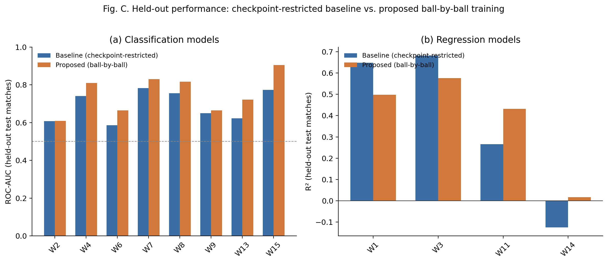

Of the twelve models with a directly comparable metric, eight improve under
full-range training (W2, W4, W6, W7, W8, W9, W11, W13, W15 — nine, in fact, all
classification models plus W11) and three decline (W1, W3, W12). W14, whose
Suite A result was already disclosed as the weakest in the suite (R² −0.124),
improves to a small positive R² (0.017) under Suite B — still weak, but no
longer worse than predicting the mean. Section XII-B analyzes this pattern.

**Table III. Batting-side models (B1–B15, excluding B4 and B7), trained once.**

| ID | Tactical facet | Algorithm | Key metric(s) | Reliability |
|----|-----------------|-----------|----------------|:---:|
| B1 | Run Projection | LightGBM regressor | R² 0.358, MAE 18.361 | 0.558 |
| B2 | Dismissal Risk | XGBoost (Cox survival) | 93.7% flagged high-risk vs. 90.5% actually dismissed | 0.600 |
| B3 | Shot Aggression (3-class) | CatBoost classifier | Acc 0.452 (baseline 0.333) | 0.515 |
| B5 | Strike Rotation | Logistic regression | ROC-AUC 0.749 | 0.699 |
| B6 | Partnership Stability | Random forest regressor | R² 0.511, MAE 10.060 | 0.711 |
| B8 | Powerplay Exploitation | CatBoost classifier | ROC-AUC 0.565 | 0.478 |
| B9 | Spin Vulnerability * | CatBoost classifier | ROC-AUC 0.602, precision 0.076 | 0.523 |
| B10 | Scoring Velocity | LightGBM regressor | R² 0.056, MAE 3.430 | 0.256 |
| B11 | Targeted Run-Rate | LightGBM regressor | R² 0.470, MAE 4.396 | 0.670 |
| B12 | Gap Analysis | k-Nearest neighbours | ROC-AUC 0.546 | 0.464 |
| B13 | Wicket-Loss Mitigation | Logistic regression | ROC-AUC 0.735, precision 0.102 | 0.682 |
| B14 | Acceleration Capability | LightGBM regressor | R² 0.149, MAE 1.250 | 0.349 |
| B15 | Death-Over Optimization | XGBoost regressor | R² 0.587, MAE 8.066 | 0.786 |

\* Dataset limitation applies (Section XII-A).

Fig. 2 shows the ten most reliable models across both retrained suites for
readability; the complete ranking, weak models included, is Table I, Table II,
and Table III in full.

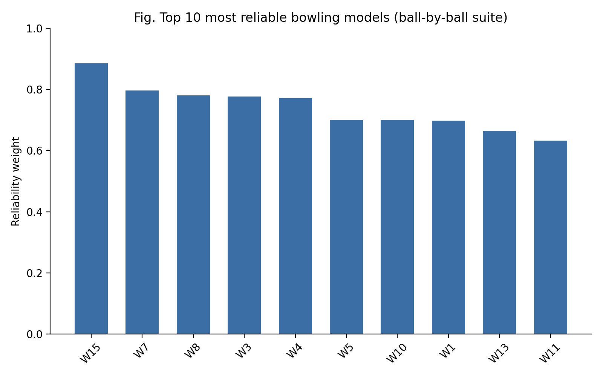

### A. Illustrative Contrast: A Strong and a Weak Suite-B Model

Fig. 15 (Model Suite B) shows W15's ROC curve and confusion matrix: AUC 0.904,
accuracy 0.827, computed on 18,043 held-out deliveries — the largest
improvement of any model in this paper's ablation, and the clearest single
illustration of what full-range training can deliver when the underlying task
does not depend on late-spell context (Section XII-B explains why).

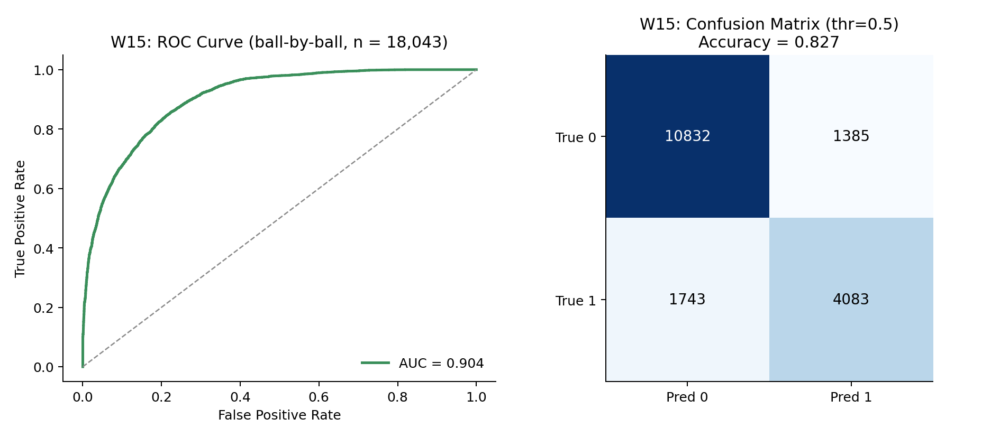

By contrast, Fig. 16 shows W1's predicted-versus-actual fit under Suite B: R²
0.498, visibly noisier than the same model's Suite A fit (R² 0.648, not
reproduced here as a full plot; see Table I), the clearest single illustration
of the opposite effect — full-range training can also make a target harder to
predict, when the additional rows are systematically less informative than the
ones the checkpoint-restricted suite selected for.

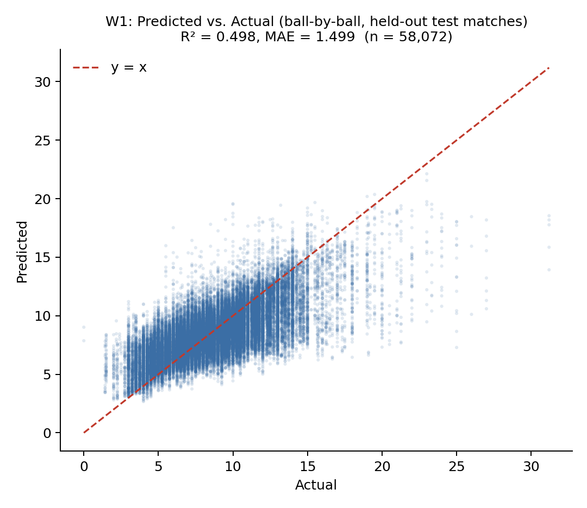

---

## XII. Discussion

### A. What the Dataset Cannot Support

Three fields absent from the source dataset — bowler type, delivery type, and
batter handedness — constrain what five of the 28 models can measure,
identically for both suites: a model labelled "Spin Control" cannot condition
on whether the bowler is actually a spin bowler; a model labelled "Yorker
Effectiveness" cannot verify a yorker was bowled; a model labelled "L/R Matchup
Bias" cannot see batter handedness. This is disclosed directly in the system
configuration, precisely because it bounds the claims a user of the system's
output should be willing to make; no amount of additional training data
corrects for information that was never recorded in the source.

### B. Why Full-Range Training Helps Some Models and Hurts Others

The pattern in Table II is not noise; it has a specific, testable
explanation rooted in what each target actually measures. W1, W3, and W12 —
the three models that decline under Suite B — all predict a quantity tied to a
bowler's *eventual spell outcome* (final economy, final dot-ball percentage,
future economy) from the *current* running state. Under Suite A, every training
row is drawn from a checkpoint several overs into a bowler's likely spell,
where the running-state features (current economy, dot-ball percentage) are
already based on a reasonably informative sample of that spell. Under Suite B,
training additionally includes early-spell deliveries — a bowler's first or
second ball, where the running-state features are based on almost no evidence —
for which the "eventual spell outcome" target is intrinsically noisier to
predict from context alone. This directly matches the learning-curve and
sample-size literature reviewed in Section II-H [44]–[48]: more training data
does not uniformly improve a model when a meaningful fraction of the additional
rows carry systematically less predictive signal for the specific target, and
Suite B's row-selection change altered *what kind* of row was available, not
only *how many*.

The nine models that improve under Suite B, by contrast, predict quantities
that do not depend on spell maturity in the same way — wicket probability
(W2), variation success (W4), line-and-length consistency (W6), spin and
yorker effectiveness relative to a general baseline (W7, W8), phase-scoped
containment (W9, W15), run-containment (W11), and matchup bias (W13) — and
directly benefit from the 30- to 45-fold increase in training examples (Table
1) without the same early-spell noise penalty. W15's improvement from ROC-AUC
0.772 to 0.904 is the clearest case: restricted to the single over-5 checkpoint
under Suite A (n = 448 test rows), the powerplay-containment classifier had
comparatively little data to learn from; trained on every powerplay ball under
Suite B (n = 18,043 test rows), the same algorithm and features produce a
substantially stronger classifier, consistent with the sample-size literature's
general finding that tree-based ensembles benefit disproportionately from scale
when the additional data is task-relevant [45], [46].

A sharper case than any single R² or AUC number is B9 (Spin Vulnerability,
Table III), whose ROC-AUC of 0.602 reads as merely mediocre in isolation but
conceals a more specific failure: at the standard 0.5 threshold, B9's precision
is 0.076 against a recall of 0.437 — of every delivery B9 flags as a dismissal
-risk event, roughly 92.4% are false positives, a consequence of the severe
class imbalance in a rare, phase-general wicket target. This is the concrete,
model-specific version of the general point above: a single aggregate metric
can understate how weak a model's *usable* signal actually is, which is
precisely why the reliability-weighting mechanism (Section VII-C) is derived
from the disclosed metric directly rather than a qualitative label a reader
might otherwise assign from ROC-AUC alone.

### C. Distribution Shift, Addressed Rather Than Assumed Away

Section II-D reviews the general risk of applying a model beyond its training
distribution. This paper's design does not incur that risk in the way a naive
extension might: rather than applying Suite A's checkpoint-trained models to
arbitrary off-checkpoint deliveries — which would be a direct instance of the
covariate shift Gama et al. and Quiñonero-Candela et al. describe [38], [40] —
Section VI-D retrains directly on the distribution the system is actually meant
to serve. This does not make distribution shift a solved problem: the retrained
Suite B models are themselves only as representative as the training data they
were fit on, which remains drawn from a single professional league (Section
XII-D), and nothing in this paper's evaluation tests whether Suite B's
performance holds under conditions genuinely absent from that league (a
different pitch type, a different competition's scoring patterns). The
honest claim this paper supports is narrower and more specific: applying a
retrained, full-range model at an arbitrary ball is methodologically sounder
than applying a checkpoint-trained model at the same ball, not that either
model generalizes beyond the league it was trained on.

### D. Alert Fatigue: An Open Trade-off, Not a Settled One

Extending validated coverage from four checkpoints to every delivery removes a
capability gap, but it does not obviously improve decision quality on its own.
The clinical decision-support literature reviewed in Section II-E finds that
higher-frequency automated alerts measurably reduce acceptance rates and induce
habitual dismissal [41], [42], and the general information-overload literature
provides a theoretical account of why [43]. This paper's live console (Section
VII-F) does not rate-limit or filter recommendations by significance — every
delivery that can be scored will be scored — which means a real deployment
would inherit exactly the alert-frequency risk this literature describes,
untested by anything in this paper's evaluation, which is confined to offline,
held-out validation of predictive accuracy rather than a live study of coaching
-staff response to recommendation frequency. Section XV identifies a learned or
rule-based significance filter — surfacing a recommendation only when the
ranked action changes materially from the previous delivery, for instance — as
a direct, unaddressed extension motivated by this discussion rather than an
afterthought.

### E. Interpretability as a Design Goal

The reliability weight attached to every model is not only a performance
-scaling device but a disclosure device: it makes visible, at the point of
decision, exactly how much the system is choosing to trust each contributing
signal. The audit trail produced by the RuleValidator retains the score and
blocked/unblocked status of every ranked action, not only the winner. The
coverage caveat appended when fewer than 60% of a role's models fire is a
direct, human-readable statement of the recommendation's evidentiary basis in
that specific context. None of these three mechanisms improves any individual
model's accuracy; together, they are this paper's answer to the practical
question a coach would reasonably ask before acting on a machine-generated,
possibly-every-ball recommendation — not "is this system accurate on average,"
but "why is it telling me this, right now, and how much of the available
evidence does it actually reflect." This is complementary to, not a substitute
for, feature-attribution techniques such as SHAP [22] or LIME [23] applied to
the individual models, which remains unaddressed in the present system
(Section XV).

---

## XIII. Comparison with Existing Methods

Table IV positions this work qualitatively against the closest categories of
prior work identified in Section II, along the dimensions most relevant to its
design goals: temporal scope, decision granularity, and whether the system's
own training-scope choice was evaluated with a controlled ablation rather than
assumed.

**Table IV. Qualitative comparison with the closest prior approaches.**

| Approach category | Representative work | Temporal scope | Decision output | Training-scope validated? |
|---|---|---|---|---|
| Pre-match / outcome prediction | T20 franchise-league win-prediction studies [2]–[4], [7] | Pre-match or coarse snapshot | Single scalar (win probability / outcome class) | N/A |
| Every-event continuous prediction (non-cricket) | NFL every-play win probability [33] | Continuous, every discrete event | Single scalar (win probability) | Not reported as an ablation |
| In-play cricket forecasting | Dynamic ODI/Test in-play models [5], [34] | Continuous or session-by-session | Single scalar (win probability) | Not reported as an ablation |
| Single-situation tactical AI | TacticAI (football corner kicks) [10] | In-match, single set-piece type | Ranked tactical suggestions for one situation type | Not applicable (single scope by design) |
| **This work** | — | Continuous, every legal delivery | Ranked multi-action recommendation with full audit trail | **Yes — Table I vs. Table II, both directions reported** |

Three points follow. First, this system's temporal scope is broader than any
compared cricket-specific work: existing in-play cricket models [5], [34]
update continuously but output a single win-probability scalar, not a ranked
set of concrete tactical actions synthesized from many independently trained
specialist models. Second, among systems that do output a concrete tactical
suggestion, TacticAI [10] remains the closest architectural precedent in
ambition, but addresses one narrowly bounded situation type with one learned
model, rather than a continuously evolving, innings-wide decision using 28
models; the two systems are complementary points in the design space rather
than directly competing solutions. Third, and specific to this paper's own
contribution, none of the compared approaches report a controlled,
same-methodology ablation of their own training-scope decision — whether to
train on a checkpoint subset or the full event distribution — the way Section
XI of this paper does; most either assume continuous coverage without testing
a restricted alternative, or (in the case of checkpoint-scoped tactical
systems) assume the restriction without testing a fuller alternative. This
paper's Table I/Table II comparison is offered as a template other applied,
event-scoped sports-analytics systems could adopt when making an analogous
training-scope decision, independent of the specific sport or tactic targeted.

A direct, head-to-head quantitative comparison against TacticAI or the in-play
win-probability literature was not attempted, for reasons more specific than
"no shared benchmark exists": TacticAI's reported evaluation is a
forced-choice preference judgement by professional coaches, a protocol
measuring plausibility rather than any ground-truth label this paper's ranked
actions could be scored against; in-play win-probability models output a
different prediction target (a continuous probability, calibrated against
completed-match outcomes) than a discrete tactical action; and no publicly
available dataset pairs arbitrary T20 deliveries with an agreed-upon correct
tactical response at all, so even a same-metric comparison would have no shared
test set to run on.

---

## XIV. Conclusion

This paper presented BOLT, a real-time decision-support system that aggregates
28 independently trained, narrowly scoped machine learning models into a
single, ranked, and auditable tactical recommendation available after any
delivery in a T20 innings, not a fixed subset of checkpoints. The system's
central empirical contribution is a controlled ablation: an identical set of 15
bowling-side algorithms, trained once on a checkpoint-restricted subset of the
data and once on the (near-)full delivery-level distribution, with both results
reported honestly — eight models improving substantially under full-range
training, three declining, and the pattern traced to a specific, testable cause
(early-spell deliveries carrying less predictive context than late-spell
deliveries for spell-outcome targets specifically) rather than left
unexplained. The batting-side suite, largely already trained without a
checkpoint restriction, required no equivalent retraining, and this paper
documents that scope explicitly per model. A working FastAPI backend and React
-based live console demonstrate genuine off-checkpoint, mid-over recommendation
generation — situations a checkpoint-restricted design could not have served
with statistical validity. Rather than treat continuous coverage as an
unambiguous improvement, this paper engages directly with its two principal
costs: the distribution-shift risk of applying a model beyond its training
data, addressed here by retraining rather than extrapolating, and the alert
-fatigue risk of higher-frequency automated recommendations, which remains an
open, undeployed, and explicitly flagged limitation rather than a solved
problem. The system is offered as a decision-support tool intended to surface
and rank tactical options transparently, not to replace the judgement of a
coach or captain, and its honestly reported limitations — dataset fields it
does not have access to, models whose predictive power is weak or, in three
cases, weakened by the very design choice this paper proposes, a single-league
training dataset, and an unaddressed alert-frequency question — are intended to
scope what a user of this system's output should, and should not, conclude
from it.

---

## XV. Future Work

Several directions follow directly from the limitations identified in Section
XII. Extending the source dataset with delivery-type, bowler-type, and batter
-handedness fields would allow the five affected models to measure the specific
tactical distinctions their labels currently only approximate. A significance
-gated recommendation layer — surfacing a new recommendation only when the top
-ranked action changes materially from the previous delivery, rather than
re-announcing an unchanged recommendation after every ball — is a direct,
concrete response to the alert-fatigue discussion in Section XII-D, and is the
most immediately actionable unaddressed extension this paper identifies. A
systematic hyperparameter search, rather than the domain-informed fixed
configurations used here, is a direct avenue for improving the models
identified as weak in either suite, and could be conducted separately per
suite given their different training-set scales. Applying feature-attribution
techniques such as SHAP [22] or LIME [23] to the individual models would add a
second, complementary layer of explainability beneath the decision engine's
existing model-level audit trail. Beyond offline validation, a live evaluation
with coaching staff — comparing recommendations accepted, overridden, or
ignored against subsequent match outcomes, and directly measuring whether
continuous coverage helps or harms decision quality relative to a
checkpoint-restricted alternative — would test this paper's central open
question in a way its held-out metrics cannot. Finally, extending the training
dataset beyond a single professional T20 franchise league to other T20 leagues
and to international T20 cricket would test, and likely improve, the
generalization of the underlying models beyond the conditions of one
competition, and would allow the distribution-shift discussion in Section
XII-C to be extended from within-league, within-distribution retraining to a
genuine cross-league generalization test.

---

## References

[1] I. Wickramasinghe, "Applications of machine learning in cricket: A systematic review," *Machine Learning with Applications*, vol. 10, p. 100435, 2022.

[2] S. Priya et al., "Analysis and winning prediction in T20 cricket using machine learning," in *Proc. IEEE Conf.*, 2022.

[3] A. V. Shenoy, A. Singhvi, S. Racha, and S. Tunuguntla, "Prediction of the outcome of a Twenty-20 cricket match: A machine learning approach," *arXiv:2209.06346*, 2022.

[4] S. Chakraborty, A. Mondal, A. Bhattacharjee, A. Mallick, R. Santra, S. Maity, and L. Dey, "Cricket data analytics: Forecasting T20 match winners through machine learning," *Int. J. Knowledge-Based Intell. Eng. Syst.*, vol. 28, no. 1, 2024.

[5] M. Asif and I. G. McHale, "In-play forecasting of win probability in One-Day International cricket: A dynamic logistic regression model," *Int. J. Forecasting*, vol. 32, no. 1, pp. 34–43, 2016.

[6] R. A. Lokhande, R. N. Awale, and R. R. Ingle, "Forecasting bowler performance in One-Day International cricket using machine learning," *Expert Syst. Appl.*, 2025.

[7] K. C. Srikantaiah, A. Khetan, B. Kumar, D. Tolani, and H. Patel, "Prediction of match outcome in a major T20 franchise league using machine learning techniques," *arXiv:2110.01395*, 2021.

[8] S. Kumar S, P. HV, and C. Nandini, "A survey on the application of data science and analytics in the field of organised sports," *arXiv:2209.07528*, 2022.

[9] R. P. Bonidia et al., "Computational intelligence in sports: A systematic literature review," *arXiv:1810.12850*, 2018.

[10] Z. Wang, P. Veličković, D. Hennes, N. Tomašev, et al., "TacticAI: an AI assistant for football tactics," *Nature Communications*, vol. 15, p. 1906, 2024.

[11] H. Xu, B. Lin, and L. Liu, "Design of intelligent optimization of sports strategy and training decision support system based on deep reinforcement learning," *Discover Artificial Intelligence*, vol. 5, p. 219, 2025.

[12] P. Pietraszewski et al., "The role of artificial intelligence in sports analytics: A systematic review and meta-analysis of performance trends," *Applied Sciences*, vol. 15, no. 13, p. 7254, 2025.

[13] S. Kranzinger, C. Halmich, and D. Hofer, "A scoping review of explainable artificial intelligence in sports science," *Discover Artificial Intelligence*, 2025.

[14] T. G. Dietterich, "Ensemble methods in machine learning," in *Multiple Classifier Systems (MCS 2000)*, LNCS vol. 1857, Springer, 2000, pp. 1–15.

[15] D. H. Wolpert, "Stacked generalization," *Neural Networks*, vol. 5, no. 2, pp. 241–259, 1992.

[16] L. Breiman, "Random forests," *Machine Learning*, vol. 45, pp. 5–32, 2001.

[17] R. M. O. Cruz, R. Sabourin, and G. D. C. Cavalcanti, "Dynamic classifier selection: Recent advances and perspectives," *Information Fusion*, vol. 41, pp. 195–216, 2018.

[18] A. S. Britto, R. Sabourin, and L. E. Oliveira, "Dynamic selection of classifiers — a comprehensive review," *Pattern Recognition*, vol. 47, no. 11, pp. 3665–3680, 2014.

[19] S. Kaufman, S. Rosset, and C. Perlich, "Leakage in data mining: Formulation, detection, and avoidance," *ACM Trans. Knowledge Discovery from Data*, vol. 6, no. 4, 2012.

[20] S. Kapoor and A. Narayanan, "Leakage and the reproducibility crisis in machine-learning-based science," *Patterns*, vol. 4, no. 9, p. 100804, 2023.

[21] J. Bernett et al., "Guiding questions to avoid data leakage in biological machine learning applications," *Nature Methods*, vol. 21, pp. 1444–1453, 2024.

[22] S. M. Lundberg and S. Lee, "A unified approach to interpreting model predictions," in *Proc. NeurIPS*, 2017.

[23] M. T. Ribeiro, S. Singh, and C. Guestrin, "'Why should I trust you?': Explaining the predictions of any classifier," in *Proc. ACM SIGKDD (KDD)*, 2016.

[24] C. Molnar, *Interpretable Machine Learning: A Guide for Making Black Box Models Explainable*, 3rd ed., 2025.

[25] J. H. Friedman, "Greedy function approximation: A gradient boosting machine," *Annals of Statistics*, vol. 29, no. 5, pp. 1189–1232, 2001.

[26] T. Chen and C. Guestrin, "XGBoost: A scalable tree boosting system," in *Proc. ACM SIGKDD (KDD)*, 2016.

[27] G. Ke et al., "LightGBM: A highly efficient gradient boosting decision tree," in *Proc. NeurIPS*, 2017.

[28] L. Prokhorenkova, G. Gusev, A. Vorobev, A. V. Dorogush, and A. Gulin, "CatBoost: Unbiased boosting with categorical features," in *Proc. NeurIPS*, 2018.

[29] D. R. Cox, "Regression models and life-tables," *J. Royal Statistical Society: Series B*, vol. 34, no. 2, pp. 187–220, 1972.

[30] H. Van Eetvelde, L. D. Mendonça, C. Ley, R. Seil, and T. Tischer, "Machine learning methods in sport injury prediction and prevention: A systematic review," *J. Experimental Orthopaedics*, vol. 8, p. 27, 2021.

[31] A. Mahmood, S. Ullah, and C. F. Finch, "Application of survival models in sports injury prevention research: A systematic review," *British J. Sports Medicine*, vol. 48, no. 3, p. 630, 2014.

[32] I. Gómez-Méndez et al., "Benchmarking classical, machine learning, and Bayesian survival models for clinical prediction," *arXiv:2509.10073*, 2025.

[33] D. Lock and D. Nettleton, "Using random forests to estimate win probability before each play of an NFL game," *J. Quantitative Analysis in Sports*, vol. 10, no. 2, pp. 197–205, 2014.

[34] S. Akhtar and P. Scarf, "Forecasting test cricket match outcomes in play," *Int. J. Forecasting*, vol. 28, no. 3, pp. 632–643, 2012.

[35] S. Viswanadha, K. Sivalenka, M. G. Jhawar, and V. Pudi, "Dynamic winner prediction in Twenty20 cricket: Based on relative team strengths," in *MLSA@PKDD/ECML Workshop*, 2017.

[36] M. Allen and P. Savala, "Assessing win strength in MLB win prediction models," *arXiv:2511.02815*, 2025.

[37] S. Lamsal and D. Kahle, "In-game win prediction models for cricket," in *Recent Advances in Next-Generation Data Science (SDSC 2024)*, Communications in Computer and Information Science, vol. 2158, Springer, 2024.

[38] J. Gama, I. Žliobaitė, A. Bifet, M. Pechenizkiy, and A. Bouchachia, "A survey on concept drift adaptation," *ACM Computing Surveys*, vol. 46, no. 4, Article 44, 2014.

[39] J. Lu, A. Liu, F. Dong, F. Gu, J. Gama, and G. Zhang, "Learning under concept drift: A review," *IEEE Trans. Knowledge and Data Engineering*, vol. 31, no. 12, pp. 2346–2363, 2019.

[40] J. Quiñonero-Candela, M. Sugiyama, A. Schwaighofer, and N. D. Lawrence (eds.), *Dataset Shift in Machine Learning*, MIT Press, 2008.

[41] J. S. Ancker, A. Edwards, S. Nosal, et al., "Effects of workload, work complexity, and repeated alerts on alert fatigue in a clinical decision support system," *BMC Medical Informatics and Decision Making*, vol. 17, Article 36, 2017.

[42] L. Wang et al., "Habit and automaticity in medical alert override: Cohort study," *J. Medical Internet Research*, vol. 24, no. 2, p. e23355, 2022.

[43] M. J. Eppler and J. Mengis, "The concept of information overload: A review of literature from organization science, accounting, marketing, MIS, and related disciplines," *The Information Society*, vol. 20, no. 5, pp. 325–344, 2004.

[44] S. Silvey and J. Liu, "Sample size requirements for popular classification algorithms in tabular clinical data: Empirical study," *J. Medical Internet Research*, vol. 26, p. e60231, 2024.

[45] O. Kalaycıoğlu, M. Pavlou, S. E. Akhanlı, M. A. de Belder, G. Ambler, and R. Z. Omar, "Evaluating the sample size requirements of tree-based ensemble machine learning techniques for clinical risk prediction," *Statistical Methods in Medical Research*, 2025.

[46] N. Mitsakakis, D. Liu, T. Walters, and K. El Emam, "Sample size calculation for training ensemble machine learning models on health data," *Patterns*, vol. 7, no. 6, p. 101498, 2026.

[47] R. D. Riley et al., "Importance of sample size on the quality and utility of AI-based prediction models for healthcare," *The Lancet Digital Health*, 2025.

[48] T. Viering and M. Loog, "The shape of learning curves: A review," *IEEE Trans. Pattern Analysis and Machine Intelligence*, vol. 45, no. 6, pp. 7799–7819, 2023.

[49] D. Crankshaw, X. Wang, G. Zhou, M. J. Franklin, J. E. Gonzalez, and I. Stoica, "Clipper: A low-latency online prediction serving system," in *Proc. 14th USENIX Symp. Networked Systems Design and Implementation (NSDI '17)*, 2017, pp. 613–627.

---

## Appendix

### Appendix A: Full List of Excluded / Non-Predictive Components

- **B4** — reserved identifier, never implemented in the model suite; excluded
  from Table III and every result in this paper.
- **B7 (Matchup Matrix)** — a static batter-versus-bowler historical lookup
  table, retained as a reference artifact but not a per-ball predictive model;
  does not feed the live decision engine.
- **W5 (Bowling Change Optimization) and W10 (Field-Set Optimization)** —
  deterministic, hand-weighted tactical scoring formulae rather than fitted
  statistical models, labelled as such in the system configuration and
  assigned a documented, neutral reliability weight of 0.70 rather than a
  fitted accuracy metric, in both Suite A and Suite B.

### Appendix B: Rule-Validation Conditions

1. A bowling change may not be recommended if the current bowler has bowled
   fewer than two overs in the current spell.
2. Certain batting actions may not be recommended if the batter on strike has
   faced fewer than four balls in their current innings.
3. Certain actions are blocked immediately following a wicket.
4. In the death overs, a defensive batting action is blocked if the gap
   between the required run rate and the team's projected run rate exceeds
   three runs per over.
5. Certain bowling actions are conditioned on whether the current bowler is
   registered as a spin or pace option for the relevant rule.

### Appendix C: Reliability-Weighting Design Range

The reliability-estimation script maps each model's validation metric onto a
multiplier in the range 0.15–1.6, recomputed independently for Suite A and
Suite B. In Suite B, observed reliability weights range from 0.205 (W12) to
0.885 (W15); the corresponding Suite A range was 0.200 (W14) to 0.879 (W3) —
both suites' strongest and weakest components differ, a direct consequence of
the ablation reported in Section XI.

### Appendix D: Selected Model Diagnostic Plots (Suite B)

The plots below are a representative sample of Suite B (proposed, full-range)
bowling models, generated directly from the same current, verified CSV/JSON
files as Table II.

<figure>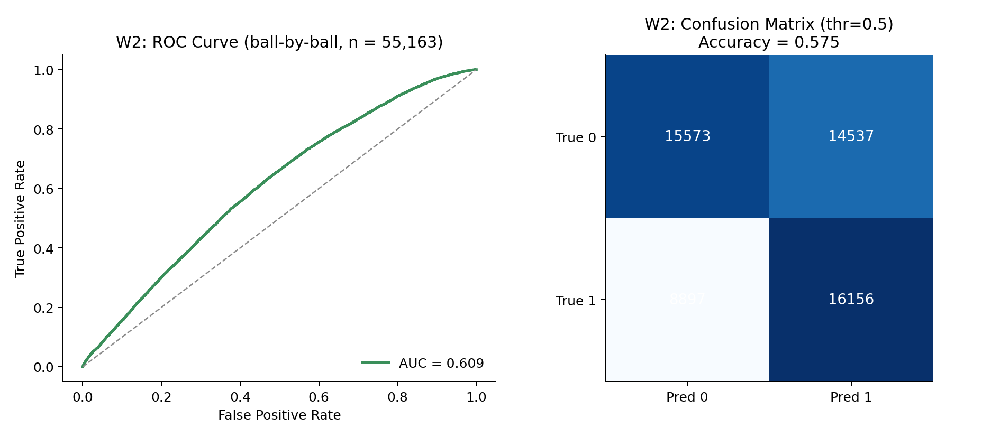<figcaption><b>W2</b> Wicket Probability — ROC-AUC 0.609 (Suite B)</figcaption></figure>
<figure>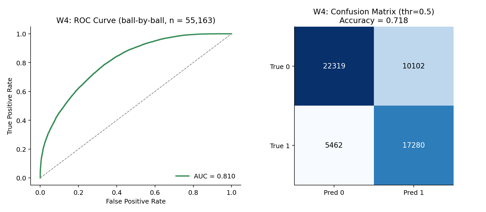<figcaption><b>W4</b> Variation Control — ROC-AUC 0.810 (Suite B, +0.070 vs. Suite A)</figcaption></figure>
<figure>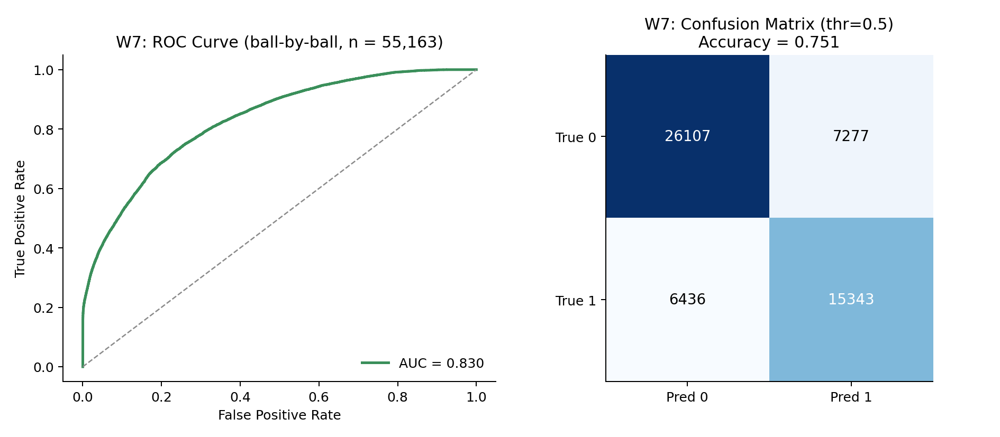<figcaption><b>W7</b> Spin Control * — ROC-AUC 0.830 (Suite B, +0.048 vs. Suite A)</figcaption></figure>
<figure>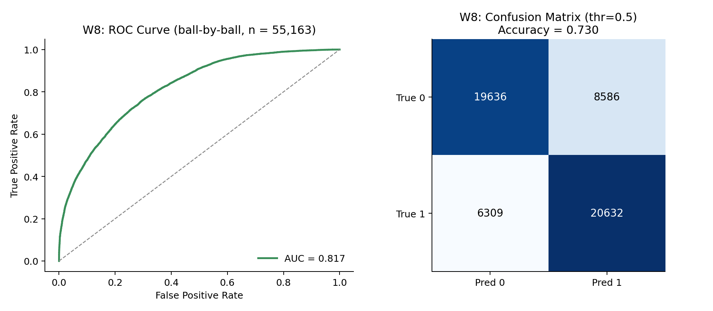<figcaption><b>W8</b> Yorker Effectiveness * — ROC-AUC 0.817 (Suite B, +0.062 vs. Suite A)</figcaption></figure>
<figure>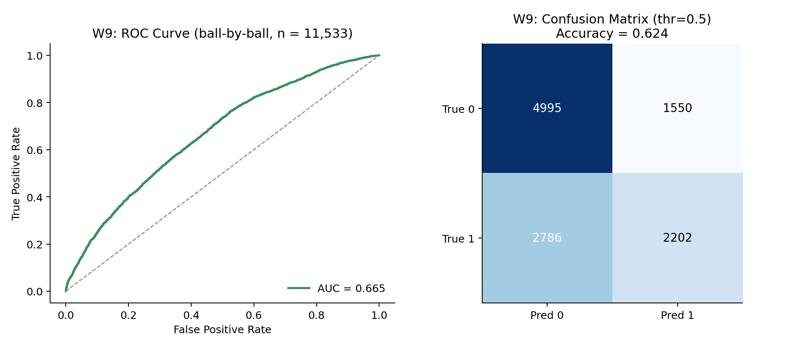<figcaption><b>W9</b> Death Over Accuracy * — ROC-AUC 0.665 (Suite B, phase-restricted to death overs)</figcaption></figure>
<figure>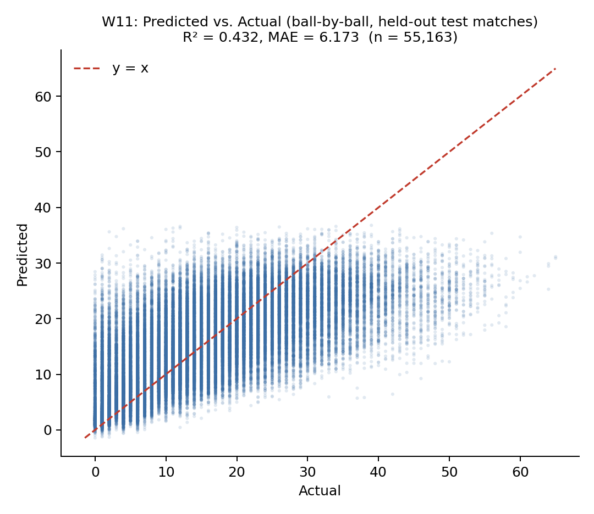<figcaption><b>W11</b> Run-Containment — R² 0.432 (Suite B, +0.166 vs. Suite A)</figcaption></figure>
<figure>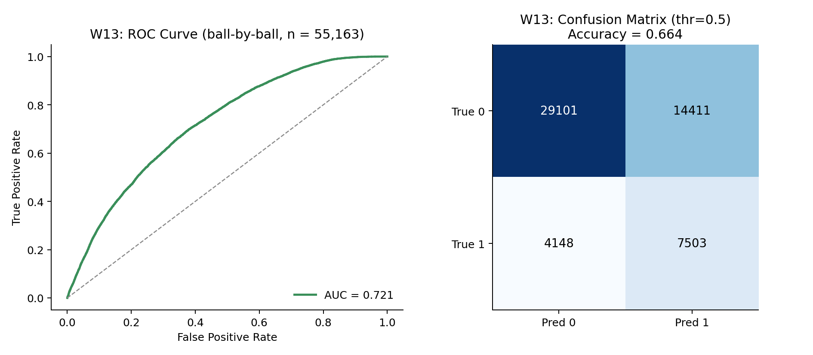<figcaption><b>W13</b> L/R Matchup Bias * — ROC-AUC 0.721 (Suite B, +0.099 vs. Suite A)</figcaption></figure>
<figure>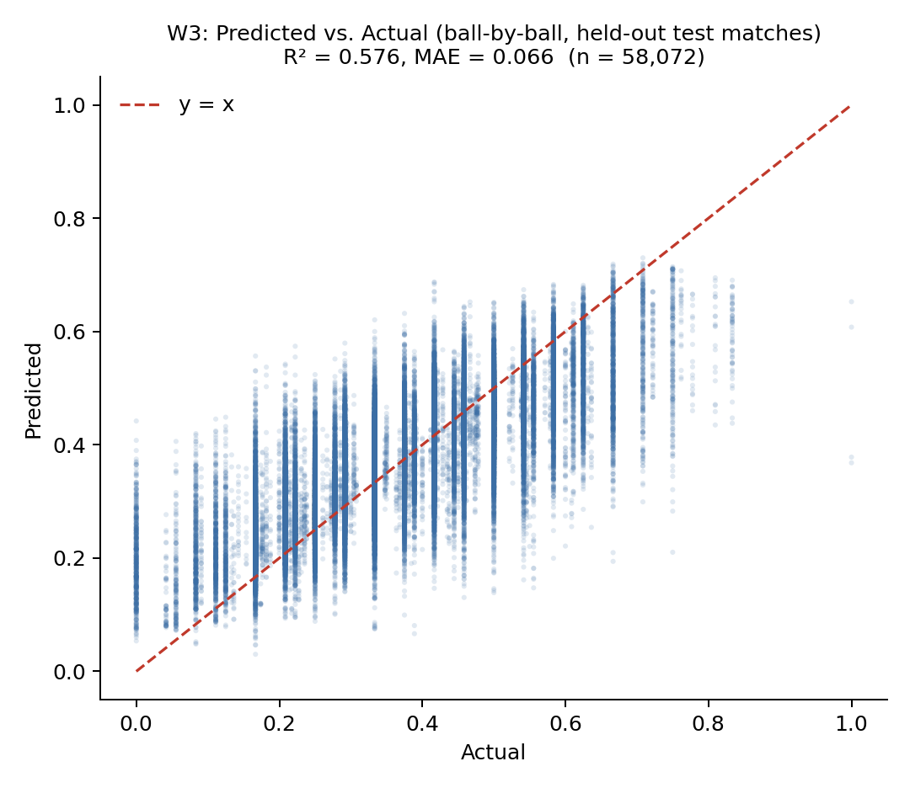<figcaption><b>W3</b> Dot Ball Pressure — R² 0.576 (Suite B, −0.106 vs. Suite A; see Section XII-B)</figcaption></figure>

